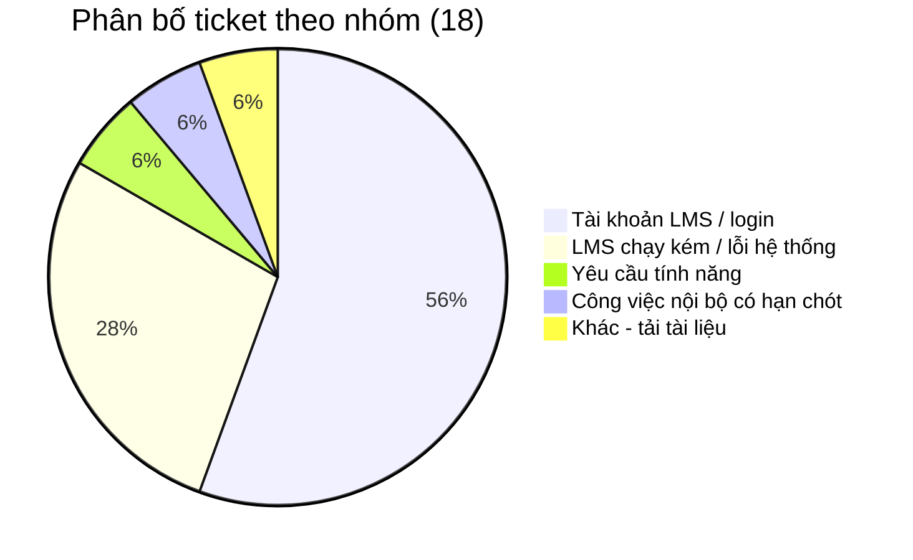

# Báo cáo phân tích ticket và lựa chọn automation login LMS

**Nguồn dữ liệu:** `Phiếu hỗ trợ (helpdesk.ticket).xlsx`  
**Phạm vi:** Helpdesk Odoo training cho bài Week 5  
**Tổng số sau khi gom ID:** 18 ticket không trùng lặp

---

## 1. Kết luận chính

Sau khi gom các dòng export theo cột `Trình tự ID phiếu hỗ trợ`, data có **18 ticket duy nhất**. Nhóm lớn nhất là **tài khoản LMS / không đăng nhập được**, gồm **10/18 ticket, tương đương khoảng 56%**.

Tuy nhiên, lý do chọn login để làm tool không chỉ vì số lượng nhiều. Em chọn nhóm này vì nó đồng thời thỏa 3 điều kiện:

- Có volume cao nhất trong dataset hiện tại.
- Có quy trình support lặp lại: nhận diện ticket login, kiểm tra email, kiểm tra HR, kiểm tra trạng thái LMS, quyết định reactivate hoặc chuyển review.
- Có thể tự động hóa trong phạm vi an toàn nếu rule rõ ràng và không tự xử lý các case thiếu dữ liệu.

Nhóm lỗi hệ thống LMS có ít ticket hơn (**5/18 ticket, khoảng 28%**) nhưng có thể ảnh hưởng nhiều user trong một lần xảy ra lỗi. Nhóm này quan trọng, nhưng không phù hợp để tool support tự auto-resolve vì nguyên nhân thường nằm ở hệ thống, content hoặc hạ tầng và cần Dev/Product kiểm tra.

Kết luận: **tool Week 5 nên tập trung vào login LMS trước**, còn các nhóm khác nên chuẩn hóa cách tiếp nhận, gom ticket trùng pattern và chuyển đúng đội xử lý.

---

## 2. Cách đọc và xử lý dữ liệu

File export Odoo có thể có nhiều dòng cho cùng một ticket do tag, stage hoặc dữ liệu liên quan được export thành nhiều dòng. Vì vậy trước khi phân tích, em không đếm số dòng Excel mà đếm theo **ticket ID duy nhất**.

Các bước xử lý:

1. Gom các dòng có cùng `Trình tự ID phiếu hỗ trợ`.
2. Đọc title và tag để xác định nhóm vấn đề.
3. Kiểm tra các ticket có nội dung giống nhau để nhận diện pattern lặp hoặc cùng một incident.
4. Đánh giá từng nhóm theo 3 tiêu chí: volume, mức độ lặp của quy trình support, và rủi ro khi automation có side effect.

Data này là dữ liệu luyện tập trên Odoo training, nên chỉ dùng để chứng minh cách phân tích và cách chọn bài toán automation trong homework. Không dùng nó để kết luận volume thật của production trong cả tháng.

---

## 3. Tổng quan phân bố ticket

| Nhóm vấn đề | Số ticket | Tỷ lệ | Ticket ID | Nhận xét nhanh |
| --- | ---: | ---: | --- | --- |
| Tài khoản LMS / không đăng nhập được | 10 | 56% | 00003, 00011, 00012, 00014, 00016, 00019, 00020, 00021, 00022, 00023 | Nhóm lớn nhất, wording khác nhau nhưng cùng bài toán login/account |
| LMS chạy kém / lỗi hệ thống | 5 | 28% | 00004, 00005, 00007, 00008, 00009 | Có dấu hiệu ảnh hưởng nhiều user hoặc nhiều ticket cùng một pattern |
| Yêu cầu tính năng | 1 | 6% | 00006 | Cần Product đánh giá, không phải case auto support |
| Công việc nội bộ có hạn chót | 1 | 6% | 00010 | Cần làm rõ scope và người có quyền xử lý |
| Khác: tải tài liệu | 1 | 6% | 00013 | Case đơn lẻ, nên xử lý theo SOP quyền/file trước |

Điểm đáng chú ý là dataset không chỉ có ticket login. Có nhóm lỗi hệ thống tuy ít ticket hơn nhưng có khả năng ảnh hưởng nhiều người hơn mỗi lần phát sinh. Vì vậy phần chọn automation cần phân biệt rõ giữa **số lượng ticket** và **mức độ phù hợp để auto xử lý**.

---

## 4. Phân tích từng nhóm

### 4.1. Tài khoản LMS / không đăng nhập được — 10 ticket

Nhóm này gồm các ticket có title như `LMS Login Issue`, `không đăng nhập được`, `ko login dc`, `login lỗi`, `Login hỏng`. Một số ticket có tag `LMS`, một số ticket không có tag rõ nhưng title vẫn đủ tín hiệu để xếp vào nhóm login.

Về mặt support, đây là nhóm phù hợp nhất để tự động hóa vì quy trình xử lý có thể chuẩn hóa:

- Xác định ticket có phải login issue không.
- Lấy email hoặc định danh user từ ticket.
- Kiểm tra user còn active trên HR hay không.
- Kiểm tra account LMS đang active hay deactivated.
- Nếu HR active và LMS deactivated thì reactivate, cập nhật ticket và phản hồi.
- Nếu thiếu dữ liệu hoặc trạng thái không rõ thì chuyển `NEED_REVIEW`.

Điểm quan trọng: automation không được tự xử lý mọi ticket login. Tool chỉ nên tự chạy ở nhánh đủ điều kiện rõ ràng. Với các case thiếu email, user inactive, không tìm thấy account, hoặc nghi lỗi hệ thống, tool phải dừng an toàn và chuyển người kiểm tra.

**Kết luận nhóm:** ưu tiên làm tool vì vừa nhiều ticket nhất, vừa có workflow lặp, vừa có thể đặt guardrail rõ.

---

### 4.2. LMS chạy kém / lỗi hệ thống — 5 ticket

Nhóm này gồm:

- `00004`: LMS performance issue, title thể hiện khoảng 15 users trong class bị ảnh hưởng.
- `00005`: submission system down, title thể hiện 50+ users và mức độ khẩn cấp.
- `00007`, `00008`, `00009`: lỗi video playback cùng Lesson 3 / class `JS-ADV-HN-2412`; có ticket ghi `(sao chép)`, cho thấy nhiều ticket có thể đến từ cùng một sự cố.

Nhóm này có số ticket thấp hơn login, nhưng mức độ ảnh hưởng theo người dùng có thể cao hơn. Ví dụ một ticket hệ thống có thể ảnh hưởng 15 hoặc 50+ users, trong khi một ticket login thường chỉ ảnh hưởng một account.

Vì vậy hướng xử lý đúng không phải là auto-resolve từng ticket, mà là:

- Xác định phạm vi ảnh hưởng: một user, một lớp, một lesson hay toàn hệ thống.
- Gom các ticket có cùng pattern thành một incident chung.
- Cập nhật cùng một thông tin trạng thái cho các ticket liên quan.
- Escalate Dev/Product nếu nguyên nhân nằm ở hệ thống, content hoặc hạ tầng.

**Kết luận nhóm:** quan trọng về impact, nhưng không phù hợp để tool support tự sửa. Automation nếu có chỉ nên hỗ trợ phát hiện pattern, gom ticket và tạo note/escalation.

---

### 4.3. Yêu cầu tính năng — 1 ticket

Ticket `00006` là yêu cầu báo cáo PDF tiến độ gửi phụ huynh. Đây không phải lỗi vận hành lặp lại, mà là yêu cầu thay đổi sản phẩm hoặc bổ sung tính năng.

Hướng xử lý phù hợp là ghi nhận đủ bối cảnh, làm rõ người dùng cần báo cáo gì, tần suất nào, format nào, rồi chuyển Product đánh giá. Support không nên hứa deadline hoặc để automation tự tạo cam kết.

**Kết luận nhóm:** không chọn auto-resolve.

---

### 4.4. Công việc nội bộ có hạn chót — 1 ticket

Ticket `00010` liên quan đến enrollment report cho Director và có deadline. Đây là ticket có yếu tố deadline và quyền truy cập dữ liệu.

Hướng xử lý phù hợp là clarify scope: cần report trường nào, kỳ nào, người nhận là ai, deadline cụ thể, và ai có quyền xuất dữ liệu. Automation không nên tự xuất hoặc gửi báo cáo nếu chưa có rule về quyền dữ liệu.

**Kết luận nhóm:** không chọn auto-resolve; có thể dùng checklist để hỗ trợ thu thập thông tin.

---

### 4.5. Khác: không tải được tài liệu — 1 ticket

Ticket `00013` là lỗi không tải được tài liệu bài học. Đây là case đơn lẻ trong dataset hiện tại.

Hướng xử lý phù hợp là kiểm tra quyền truy cập, file có tồn tại không, user có được assign vào course/class không, và lỗi xảy ra trên file nào. Nếu nhóm này tăng volume trong tương lai thì có thể viết SOP hoặc checklist riêng.

**Kết luận nhóm:** chưa đủ volume để ưu tiên automation ở Week 5.

---

## 5. Vì sao chọn login thay vì nhóm khác?

Không phải nhóm có nhiều ticket nhất luôn là nhóm nên tự động hóa trước. Một nhóm chỉ phù hợp để auto khi có đủ 3 yếu tố: volume đủ lớn, quy trình xử lý lặp, và rủi ro side effect thấp hoặc kiểm soát được.

| Tiêu chí | Login LMS | Lỗi hệ thống LMS | Feature / deadline / tải tài liệu |
| --- | --- | --- | --- |
| Volume trong dataset | Cao nhất: 10/18 | Thứ hai: 5/18 | Thấp: mỗi nhóm 1 ticket |
| Quy trình support | Lặp lại, có thể viết rule | Mỗi sự cố có nguyên nhân khác nhau | Cần judgment hoặc clarify |
| Dữ liệu cần kiểm tra | Email, HR status, LMS status | Log, content, hạ tầng, phạm vi ảnh hưởng | Scope, quyền, yêu cầu nghiệp vụ |
| Rủi ro khi auto sai | Có thể kiểm soát bằng guardrail | Cao, có thể che mất sự cố thật | Cao hoặc không phù hợp |
| Phù hợp làm tool Week 5 | Có | Chưa auto-resolve, chỉ hỗ trợ gom/escalate | Không ưu tiên |

Từ bảng trên, login LMS là lựa chọn hợp lý nhất cho homework vì nó vừa có số lượng cao, vừa biến được thành workflow rõ ràng:

`nhận diện login ticket -> kiểm tra dữ liệu -> quyết định AUTO_RESOLVE / NEED_REVIEW / SKIP`.

---

## 6. Decision flow cho ticket login

Sau khi chọn nhóm login, em không để tool xử lý theo cảm tính từng ticket. Em tách thành decision flow để mỗi bước đều có điều kiện rõ ràng: đủ dữ liệu thì xử lý, thiếu dữ liệu hoặc rủi ro quyền truy cập thì dừng an toàn.

### Bước 1: Ticket có đúng là login issue không?

**Giả định:** Ticket có thể có tag `LMS`, hoặc title/description chứa các từ như `login`, `đăng nhập`, `không vào được`, `ko login dc`.

**Cách xử lý:** Nếu có tín hiệu login thì đi tiếp. Nếu không có tín hiệu login thì bỏ qua vì nằm ngoài phạm vi tool Week 5.

**Decision:** Không phải login issue → `SKIP`.

### Bước 2: Ticket có đủ định danh user không?

**Giả định:** Ticket login nhưng có thể thiếu email hoặc mã user, ví dụ chỉ ghi “không login được”.

**Cách xử lý:** Tool không được đoán user. Nếu không trích xuất được email/định danh hợp lệ thì yêu cầu bổ sung thông tin hoặc để support kiểm tra thủ công.

**Decision:** Thiếu email/định danh → `SKIP` hoặc hỏi bổ sung thông tin.

### Bước 3: User còn active trên HR không?

**Giả định:** Nếu user không còn active trên HR, việc bật lại LMS có thể cấp quyền sai cho người không còn thuộc tổ chức/lớp học.

**Cách xử lý:** Chỉ kiểm tra và ghi nhận kết quả. Tool không tự reactivate LMS cho user inactive.

**Decision:** HR inactive → `NEED_REVIEW`.

### Bước 4: Trạng thái account LMS là gì?

**Giả định:** Sau khi xác nhận user còn active, lỗi login có thể đến từ nhiều trạng thái khác nhau: LMS bị deactivated, account vẫn active nhưng quên mật khẩu, không tìm thấy account, hoặc nghi lỗi hệ thống.

| Trạng thái LMS | Cách xử lý | Decision |
| --- | --- | --- |
| LMS deactivated + HR active | Reactivate account, ghi note, phản hồi user | `AUTO_RESOLVE` |
| LMS active nhưng user quên mật khẩu | Gửi hướng dẫn reset nếu tool được mở rộng bằng template/KB | `NEED_REVIEW` trong phạm vi hiện tại |
| Không tìm thấy LMS account | Không tự tạo account, chuyển support kiểm tra | `NEED_REVIEW` |
| Nghi lỗi hệ thống / không xác định được | Ghi note và chuyển người xử lý | `NEED_REVIEW` |

### Bước 5: Có tài liệu/template để phản hồi không?

**Giả định:** Một số case không cần sửa account mà cần gửi hướng dẫn, ví dụ reset password hoặc cách đăng nhập đúng.

**Cách xử lý:** Nếu đã có template/KB thì có thể mở rộng tool để gửi phản hồi chuẩn. Nếu chưa có tài liệu thì cần người viết SOP/template trước, sau đó automation mới dùng lại được.

**Decision:** Có template rõ → có thể mở rộng automation; chưa có template → người phụ trách bổ sung docs.

### Kết luận decision flow

Tool chỉ được `AUTO_RESOLVE` trong case hẹp nhất: **user HR active và account LMS đang deactivated**. Các case còn lại không bị bỏ qua hoàn toàn, nhưng chỉ nên dừng ở mức hỏi thêm thông tin, gửi hướng dẫn, ghi note hoặc chuyển `NEED_REVIEW`.

---

## 7. Phạm vi tool Week 5

Tool `week-5/odoo-automation` nên giữ phạm vi hẹp và an toàn:

- Quét ticket ở stage intake hoặc nhận ticket qua webhook.
- Nhận diện login issue bằng tag/title/description.
- Trích xuất email hợp lệ từ ticket.
- Kiểm tra HR mock và LMS mock.
- Chỉ auto-resolve khi `HR = active` và `LMS = deactivated`.
- Với các case khác, ghi note nội bộ và chuyển `NEED_REVIEW` hoặc `SKIP`.

| Điều kiện | Quyết định | Lý do |
| --- | --- | --- |
| Không phải ticket login | `SKIP` | Không xử lý ngoài phạm vi |
| Login nhưng thiếu email | `SKIP` hoặc yêu cầu bổ sung | Không đủ định danh user |
| HR active + LMS deactivated | `AUTO_RESOLVE` | Điều kiện rõ, side effect hợp lý |
| HR inactive | `NEED_REVIEW` | Không tự cấp quyền cho user không active |
| Không tìm thấy LMS account | `NEED_REVIEW` | Có thể cần tạo account hoặc sửa dữ liệu |
| Nghi lỗi hệ thống | `NEED_REVIEW` / escalate Dev | Không phải case account đơn lẻ |

Nguyên tắc vận hành: **đủ dữ liệu và rule rõ thì tự xử lý; thiếu dữ liệu hoặc rủi ro quyền truy cập thì dừng an toàn.**

---

## 8. Tool hay sửa nguyên nhân gốc?

Nếu nhiều user bị deactivate LMS vì một rule hệ thống, có thể đặt câu hỏi: nên làm tool support hay sửa rule gốc?

Trong thực tế, hai hướng này không loại trừ nhau:

- **Ngắn hạn:** support vẫn nhận ticket hằng ngày, nên tool giúp giảm thao tác lặp cho nhóm login đang chiếm 56% data.
- **Dài hạn:** Product/Dev có thể kiểm tra lại rule deactivate, thêm cảnh báo trước khi khóa, bổ sung hướng dẫn reset password, hoặc cải thiện luồng tự phục vụ.

Vì vậy tool Week 5 nên được hiểu là giải pháp vận hành để giảm tải hiện tại, không phải kết luận rằng nguyên nhân gốc đã được xử lý.

---

## 9. Hướng xử lý cho nhóm không chọn automation trước

### LMS chạy kém / lỗi hệ thống

Gom ticket cùng pattern, cập nhật chung và escalate Dev/Product. Nếu nhiều ticket cùng lesson/class/thời điểm, nên xem là một incident chung thay vì xử lý như các ticket rời rạc.

### Feature request

Ghi nhận yêu cầu, làm rõ use case và chuyển Product. Không auto hứa deadline hoặc tự thay đổi scope sản phẩm.

### Báo cáo nội bộ có deadline

Clarify thông tin cần xuất, deadline, người nhận, quyền dữ liệu và người chịu trách nhiệm. Automation chỉ nên hỗ trợ checklist, không tự gửi dữ liệu nhạy cảm.

### Tải tài liệu

Kiểm tra quyền truy cập, file, course/class assignment. Theo dõi thêm volume; nếu xuất hiện nhiều lần thì viết SOP riêng.

---

## 10. Kết luận

Từ export Helpdesk Odoo, sau khi gom ID có **18 ticket duy nhất**. Nhóm **tài khoản LMS / không đăng nhập được** chiếm **10/18 ticket (~56%)**, là nhóm lớn nhất và có quy trình support lặp lại nhất.

Nhóm **LMS chạy kém / lỗi hệ thống** có **5/18 ticket (~28%)** và có thể ảnh hưởng nhiều user hơn trong từng sự cố, nhưng không phù hợp để auto-resolve vì cần kiểm tra nguyên nhân hệ thống. Các nhóm còn lại chỉ có 1 ticket, chưa đủ volume hoặc không phù hợp để tự động hóa.

Vì vậy, lựa chọn hợp lý cho Week 5 là làm tool xử lý ticket login LMS với guardrail rõ: chỉ `AUTO_RESOLVE` khi user còn active và account LMS bị deactivate; các trường hợp thiếu dữ liệu, inactive, không tìm thấy account hoặc nghi lỗi hệ thống thì chuyển `NEED_REVIEW`/`SKIP`.

**Evidence:** `Phiếu hỗ trợ (helpdesk.ticket).xlsx`  
**Tool:** `week-5/odoo-automation`
