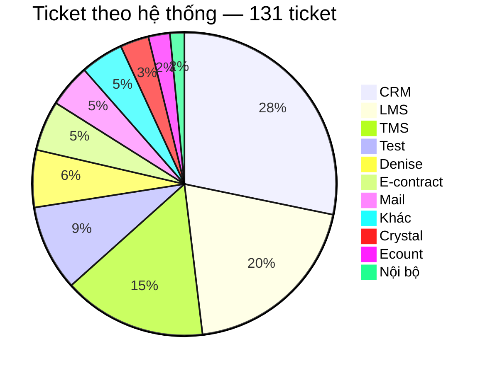
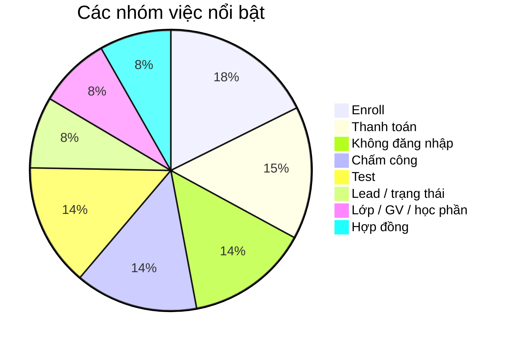
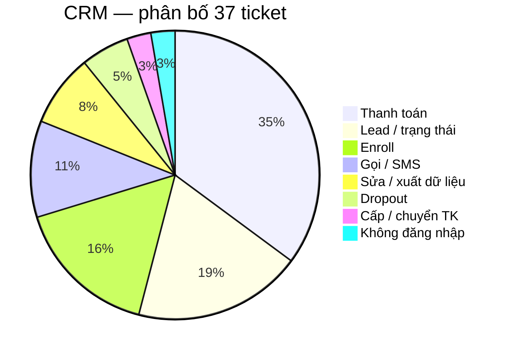
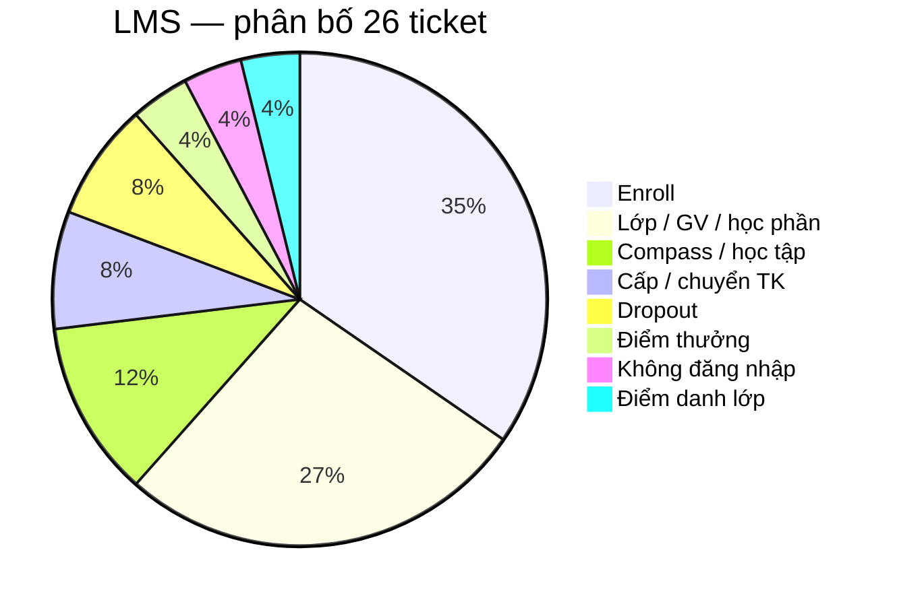
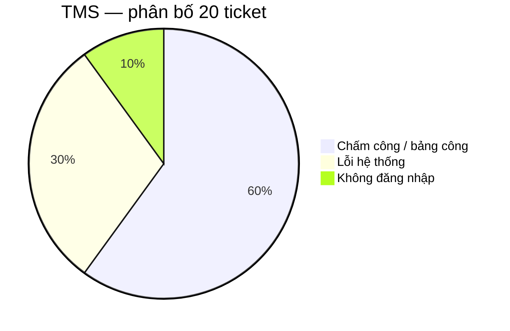
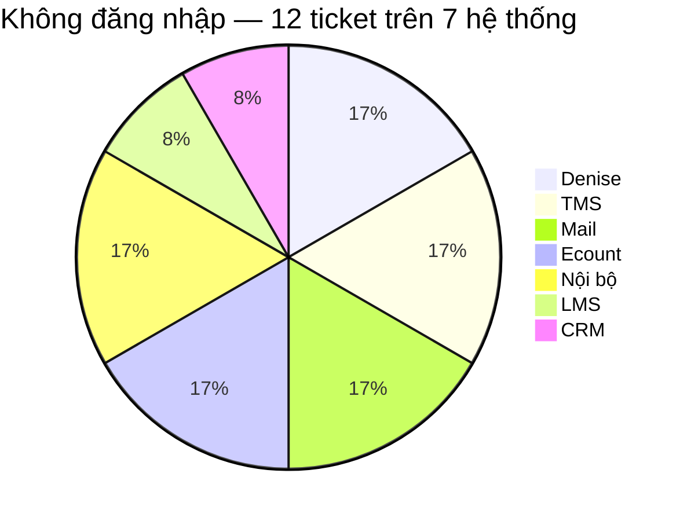
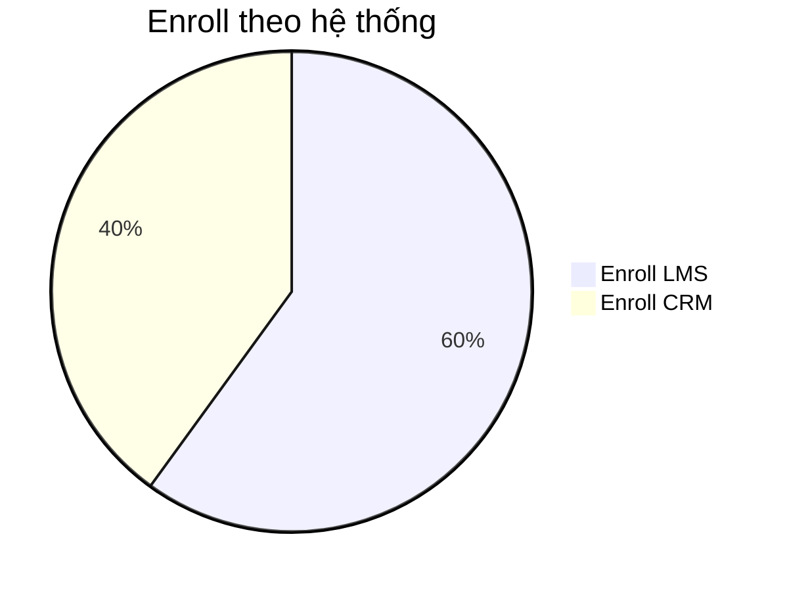

# Báo cáo phân tích ticket — Technical Support

**Nguồn dữ liệu:** `docs/plans/week-5/data/sample.xlsx`  
**Phạm vi:** 131 ticket Technical Support

---

## 1. Mục tiêu

Báo cáo dùng dữ liệu sample để:

- Nhận diện ticket đang tập trung ở đâu và theo nhóm vấn đề nào.
- Đưa ra **giả định** cho từng nhóm khi dữ liệu chưa đủ xác nhận root cause.
- Với mỗi giả định, nêu **phương án** xử lý tương ứng.
- Chọn nhóm phù hợp để thử automation theo hướng Operating Engineer và xác định cần đo gì tiếp theo.

---

## 2. Nguồn dữ liệu

Report dùng file `docs/plans/week-5/data/sample.xlsx`. Sau khi gom theo mã ticket và phân loại bằng `Subject + Tags`, dataset có **131 ticket**.

File hiện chủ yếu có Subject/Tags, chưa có log xử lý, thời gian phản hồi hay nguyên nhân cuối cùng. Vì vậy các nhánh dưới đây là **giả định vận hành** để định hướng xử lý, không phải root cause đã xác nhận.

---

## 3. Ticket đang tập trung ở đâu?



CRM, LMS và TMS có tổng cộng **83/131 ticket (~63,4%)**.

Số ticket cao chưa đồng nghĩa hệ thống có tỷ lệ lỗi cao. File không có số người dùng theo hệ thống, nên chưa tính được ticket trên mỗi user.

Các nhóm việc nổi bật:



Enroll có 15 ticket (LMS 9, CRM 6). Thanh toán có 13 ticket, toàn bộ trên CRM. Không đăng nhập và chấm công mỗi nhóm 12 ticket.

---

## 4. Phân tích ba hệ thống có nhiều ticket nhất

### 4.1. CRM — 37 ticket



Ba nhóm lớn nhất là Thanh toán 13, Lead/trạng thái 7 và Enroll 6, tổng **26/37 ticket (~70,3%)**.

#### Thanh toán — 13 ticket

Nhóm gồm tạo QR, add/gỡ payment, hủy hoặc confirm giao dịch, cập nhật trạng thái đóng tiền, hóa đơn và mã giảm giá. Volume cao nhưng chưa chứng minh cùng một lỗi lặp 13 lần.

| Giả định | Phương án |
| --- | --- |
| Ticket thiếu mã lead/enrollment, số tiền hoặc yêu cầu cụ thể | Chuẩn hóa form đầu vào trước khi support xử lý |
| Người dùng được phép tự làm nhưng chưa biết thao tác | Gửi hướng dẫn |
| Chưa có tài liệu hướng dẫn | Bổ sung guide/SOP |
| Đã có tài liệu nhưng user vẫn tạo ticket | Kiểm tra tài liệu có dễ tìm và còn đúng không; nếu đúng thì auto-reply kèm tài liệu |
| Người dùng không có quyền | Route đến người/bộ phận có quyền |
| Thao tác đúng, quyền đủ nhưng CRM vẫn lỗi | Escalate Dev kèm bước tái hiện và ảnh lỗi |
| Thao tác tài chính bắt buộc phải có người duyệt | Giữ xử lý thủ công, không auto sửa dữ liệu payment |

#### Lead / trạng thái — 7 ticket

| Giả định | Phương án |
| --- | --- |
| User có quyền nhưng chưa biết đổi trạng thái | Hướng dẫn hoặc gửi guide |
| User không có quyền | Chuyển người có quyền |
| Dữ liệu hợp lệ nhưng CRM không cho đổi | Ghi lỗi và escalate hệ thống |
| Đổi trạng thái ảnh hưởng quy trình kinh doanh | Không auto đổi trạng thái khi chưa có rule rõ |

#### Enroll trên CRM — 6 ticket

| Giả định | Phương án |
| --- | --- |
| Thiếu mã enrollment/lead hoặc thông tin cần sửa | Bắt buộc field đầu vào |
| User được phép tự sửa nhưng chưa biết cách | Hướng dẫn / gửi guide |
| Đã có guide nhưng ticket vẫn vào | Auto-reply kèm tài liệu nếu guide còn đúng |
| User không có quyền | Route đúng owner |
| Quyền và dữ liệu đủ nhưng CRM vẫn lỗi | Escalate Dev |

---

### 4.2. LMS — 26 ticket



Hai nhóm lớn nhất là Enroll 9 và Lớp/GV/học phần 7, tổng **16/26 ticket (~61,5%)**.

#### Enroll trên LMS — 9 ticket

| Giả định | Phương án |
| --- | --- |
| User thao tác chưa đúng | Gửi hướng dẫn enroll |
| Chưa có guide enroll LMS | Bổ sung tài liệu |
| Đã có guide nhưng user vẫn không enroll được | Auto-reply kèm guide; nếu vẫn fail thì kiểm tra dữ liệu/quyền |
| Không tìm thấy lớp hoặc slot | Kiểm tra dữ liệu lớp trước khi kết luận lỗi hệ thống |
| Enroll trùng | Kiểm tra học viên đã tồn tại trong lớp hay hệ thống hiển thị sai |
| User thiếu quyền | Chuyển người có quyền |
| Dữ liệu và quyền đúng nhưng LMS vẫn lỗi | Escalate Dev kèm ảnh lỗi và bước đã thử |

Chưa nên tự động enroll học viên khi chưa có đủ rule nghiệp vụ và ngoại lệ.

#### Lớp / giáo viên / học phần — 7 ticket

| Giả định | Phương án |
| --- | --- |
| User được phép tự chỉnh nhưng chưa biết cách | Hướng dẫn / gửi guide |
| User không có quyền chỉnh lớp/GV | Route đúng owner |
| Chức năng đang lỗi | Ghi thao tác, dữ liệu đầu vào, ảnh lỗi rồi escalate Dev |

---

### 4.3. TMS — 20 ticket



Có **18/20 ticket TMS (~90%)** nằm ở chấm công hoặc lỗi hệ thống.

#### Chấm công / bảng công — 12 ticket

| Giả định | Phương án |
| --- | --- |
| Ticket thiếu cơ sở, thời điểm, ca hoặc số người bị ảnh hưởng | Chuẩn hóa field đầu vào |
| Chỉ một người bị sai công | Kiểm tra lịch/dữ liệu của cá nhân đó |
| Nhiều người cùng ca hoặc cùng cơ sở | Kiểm tra dữ liệu/cấu hình chung, không xử lý từng người rời rạc |
| Nhiều cơ sở cùng thời điểm | Kiểm tra incident hệ thống |
| User chỉ chưa biết xem/duyệt công | Gửi guide nếu có quyền tự làm |
| Đã có guide nhưng vẫn hỏi | Auto-reply kèm tài liệu nếu guide còn đúng |

Không để tool tự sửa bảng công.

#### Lỗi hệ thống — 6 ticket

Ticket **233** và **234** cùng liên quan Tỉnh Nam 2, triệu chứng tương tự và cùng nhắc lỗi từ ngày 31.

| Giả định | Phương án |
| --- | --- |
| Chỉ một người gặp | Kiểm tra tài khoản/dữ liệu cá nhân |
| Nhiều người cùng cơ sở | Kiểm tra cấu hình/dữ liệu chung của cơ sở |
| Nhiều cơ sở cùng thời điểm | Điều tra theo incident hệ thống |
| Nhiều ticket trùng thời gian, khu vực, triệu chứng | Gợi ý gom ticket liên quan để support xác nhận |

---

## 5. Pattern xuất hiện trên nhiều hệ thống

### 5.1. Không đăng nhập / tài khoản — 12 ticket trên 7 hệ thống



Không hệ thống nào chiếm phần lớn nhóm login. Chuỗi kiểm tra thường lặp: xác định user → kiểm tra nhân sự → kiểm tra tài khoản → xác định nguyên nhân → reset/mở khóa nếu đủ điều kiện → phản hồi.

Đây là nhóm phù hợp để thử workflow hơn một số nhóm volume cao hơn, vì điều kiện xử lý có thể giới hạn rõ. Workflow Week 5 không cover hết mọi hệ thống; ưu tiên LMS theo Scenario 1.

### 5.2. Enroll LMS và Enroll CRM



Hai nhóm cùng tên nhưng cần form và SOP riêng. LMS thiên về thêm học viên/lớp/slot. CRM thiên về enrollment hoặc chỉnh thông tin enrollment.

---

## 6. Giả định và phương án cho Login Issue

Dữ liệu sample cho thấy có pattern login/account, nhưng chưa đủ để khẳng định mọi ticket đều cùng một root cause. Vì vậy automation chỉ chạy theo từng giả định đủ điều kiện.

| Giả định | Phương án |
| --- | --- |
| Ticket không phải login issue | `SKIP`, không xử lý |
| Thiếu email/định danh của account cần kiểm tra | Không đoán user; hỏi bổ sung hoặc `NEED_REVIEW` |
| Chưa có tài liệu hướng dẫn reset/login | Bổ sung guide/SOP trước |
| Đã có tài liệu nhưng user vẫn không đăng nhập được | Automation reply kèm tài liệu hướng dẫn |
| HR active + LMS deactivated | `AUTO_RESOLVE`: reactivate, ghi note, phản hồi |
| HR inactive | Không bật lại LMS; `NEED_REVIEW` |
| LMS active nhưng user quên mật khẩu | Gửi hướng dẫn reset nếu có template |
| Không tìm thấy LMS account | Không tự tạo account; `NEED_REVIEW` |
| Nhiều người cùng lúc không login được cùng hệ thống | Không xử lý như quên pass riêng lẻ; kiểm tra incident |
| Nghi lỗi hệ thống / ngoài phạm vi tool | Escalate support/Dev |

### Workflow tương ứng

```text
Odoo ticket mới
  -> nhận diện login issue
  -> trích xuất email/định danh account cần kiểm tra
  -> kiểm tra HR + LMS
  -> quyết định theo giả định ở bảng trên
  -> cập nhật Odoo ticket + phản hồi
```

Nếu nguyên nhân gốc là rule deactivate sau thời gian không hoạt động, Dev/Product có thể sửa rule về lâu dài. Trong ngắn hạn, automation giúp giảm thao tác lặp mà không cần chờ sửa code trước.

---

## 7. Metrics cần đo sau automation

- Số ticket login được workflow nhận diện.
- Tỷ lệ xử lý hoàn toàn (`AUTO_RESOLVE`).
- Tỷ lệ vẫn cần support (`NEED_REVIEW`).
- Tỷ lệ `SKIP` vì thiếu thông tin hoặc ngoài phạm vi.
- Thời gian xử lý trước và sau automation.
- Số false action hoặc xử lý sai account.

Chỉ nên kết luận mức tiết kiệm thời gian sau khi có số liệu thực tế.

---

## 8. Kết luận

CRM, LMS và TMS chiếm **83/131 ticket (~63,4%)**, nên đây là ba hệ thống cần ưu tiên theo workload. Với các nhóm volume cao như Payment, Enroll và Chấm công, hướng trước mắt là chuẩn hóa thông tin đầu vào, guide/routing theo quyền, và chỉ escalate khi đủ bằng chứng lỗi hệ thống.

Login không phải nhóm lớn nhất, nhưng có chuỗi kiểm tra lặp và có thể đặt giả định–phương án rõ. Vì vậy Week 5 chọn Login LMS để thử automation có điều kiện: thiếu docs thì bổ sung; đã có docs mà vẫn fail thì reply kèm tài liệu; HR active + LMS deactivated thì auto reactivate; các case thiếu dữ liệu hoặc rủi ro thì chuyển review.

Bước tiếp theo là đo coverage, tỷ lệ xử lý hoàn toàn, tỷ lệ cần support can thiệp và thời gian xử lý thực tế trước khi mở rộng automation sang nhóm khác.
