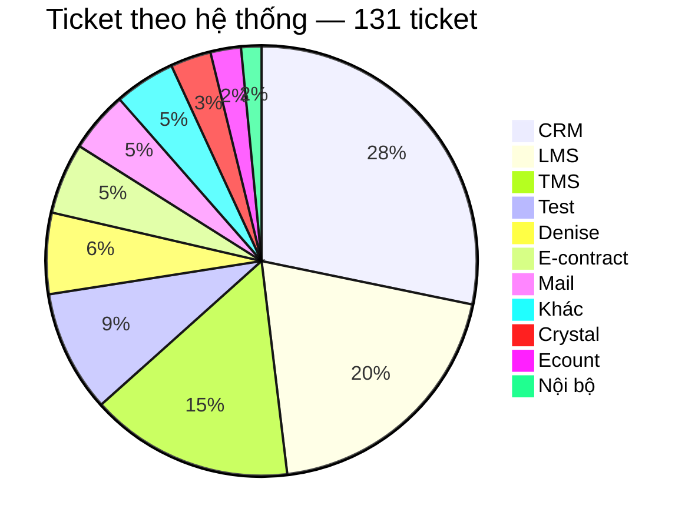
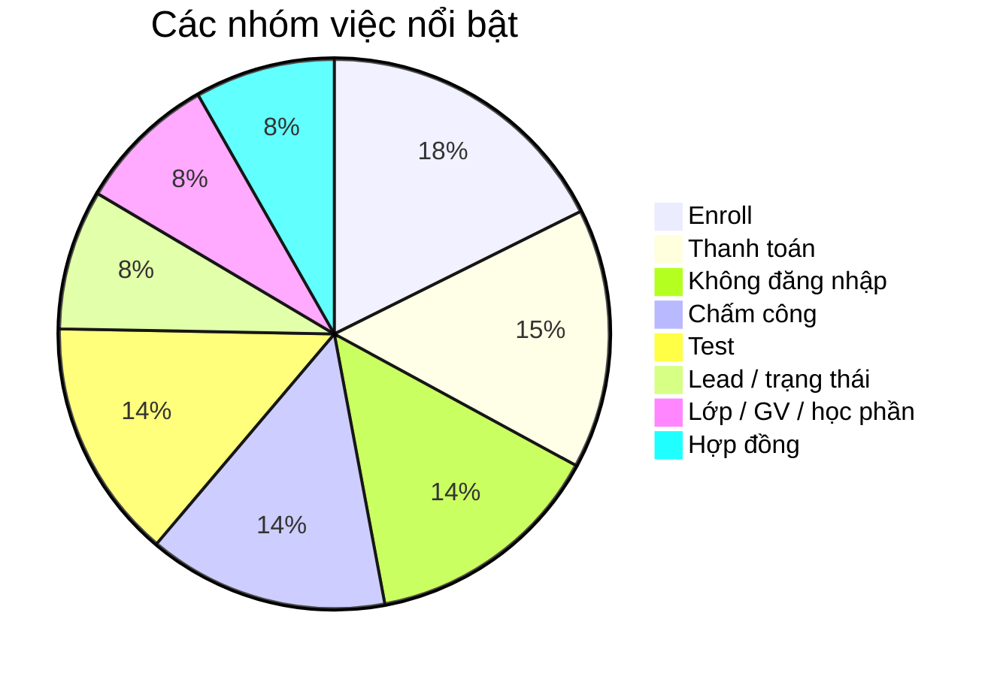
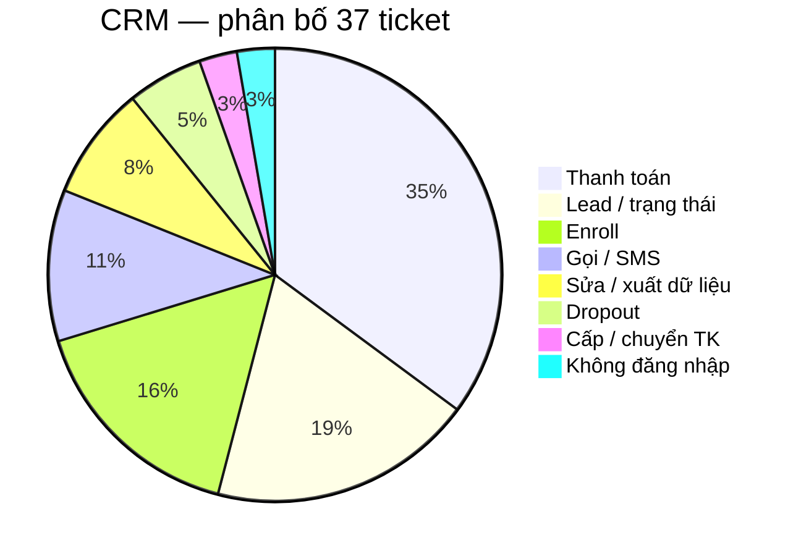
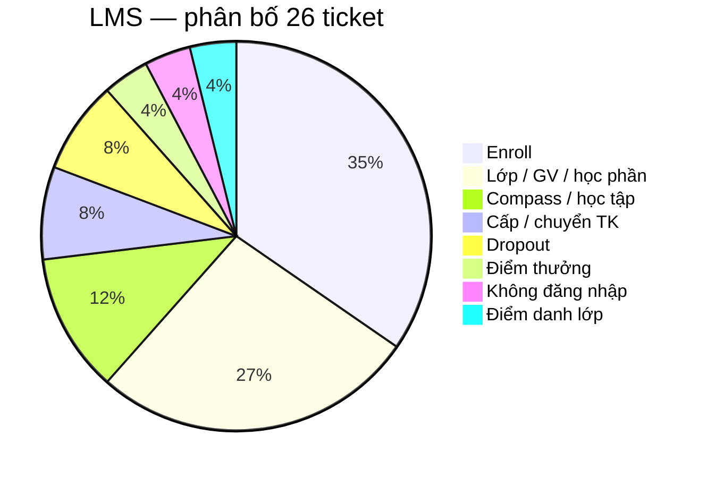
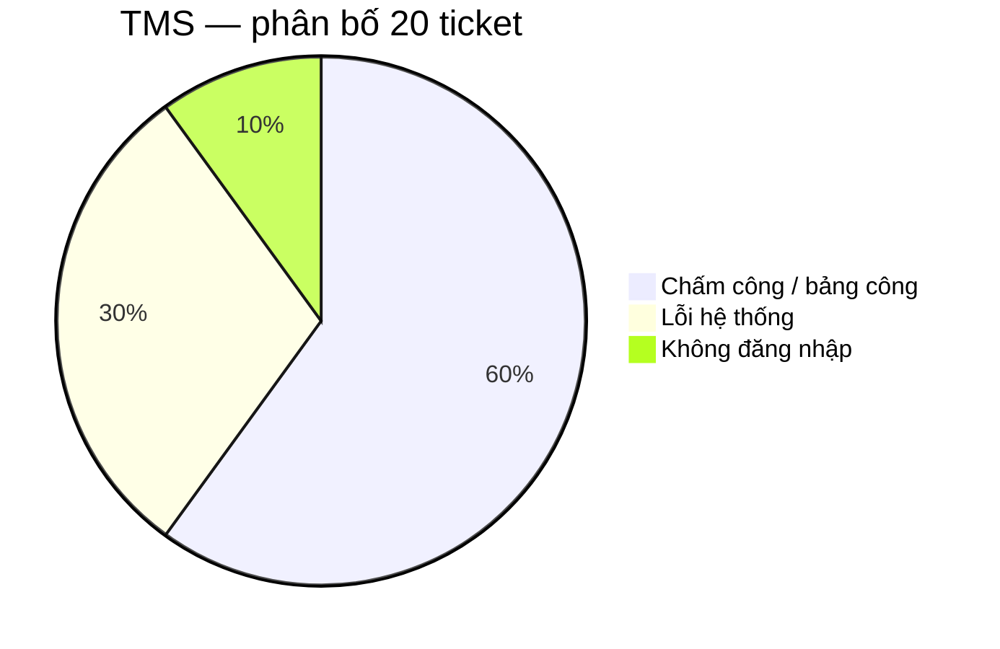
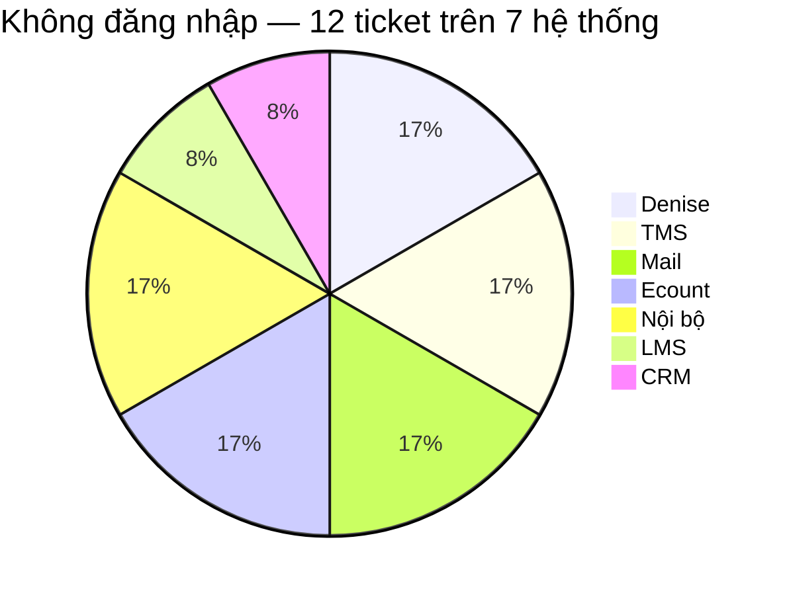
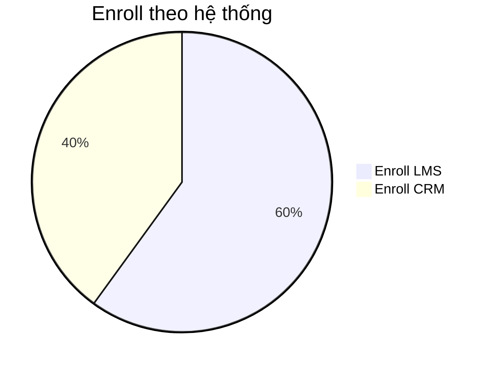
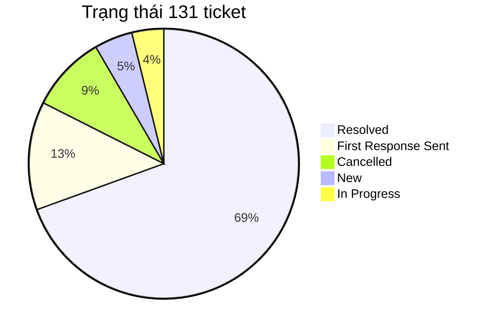
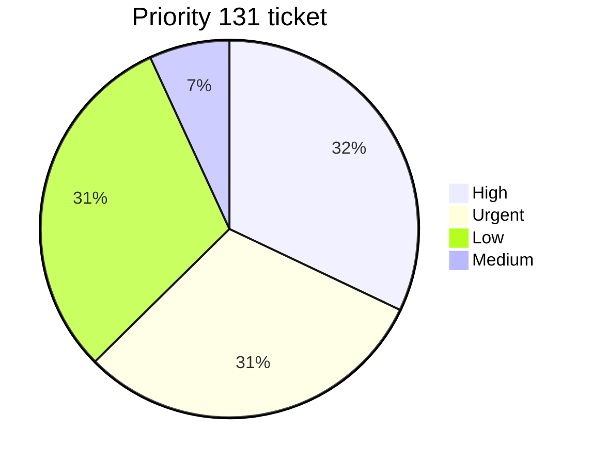

# Báo cáo phân tích ticket — Technical Support

**Nguồn dữ liệu:** `docs/plans/week-5/data/sample.xlsx`  
**Phạm vi:** 131 ticket Technical Support

---

## 1. Mục tiêu

Báo cáo dùng dữ liệu sample để trả lời bốn câu hỏi:

- Ticket đang tập trung ở đâu?
- Trong các khu vực đó, người dùng đang gặp loại vấn đề nào?
- Support có thể đang xử lý theo kiểu nào: hướng dẫn, xin quyền, điều tra lỗi, chuyển bộ phận hay thao tác lặp lại?
- Với từng nhóm, hướng cải thiện nào hợp lý và cần đo thêm gì trước khi mở rộng automation?

---

## 2. Nguồn dữ liệu

Report dùng file `docs/plans/week-5/data/sample.xlsx`. Sau khi gom theo mã ticket và phân loại bằng `Subject + Tags`, dataset có **131 ticket**.

Dữ liệu hiện tại chủ yếu cho biết nội dung ticket. Chưa có log xử lý chi tiết, thời gian phản hồi, số người bị ảnh hưởng hay nguyên nhân cuối cùng. Vì vậy report phân biệt rõ quan sát từ data và các trường hợp cần kiểm tra thêm.

---

## 3. Ticket đang tập trung ở đâu?



CRM, LMS và TMS có tổng cộng **83/131 ticket**, chiếm **63,4%** toàn bộ dữ liệu.

Số ticket cao chưa đồng nghĩa hệ thống đó có tỷ lệ lỗi cao. File không có số người dùng theo hệ thống, nên chưa thể tính ticket trên mỗi user. Một hệ thống có nhiều ticket có thể do lượng người dùng lớn, nghiệp vụ phức tạp, quyền hạn khó xử lý, người dùng chưa biết thao tác hoặc hệ thống thực sự lỗi.

Các nhóm việc nổi bật:



Enroll có 15 ticket (LMS 9, CRM 6). Thanh toán có 13 ticket và toàn bộ nằm trên CRM. Không đăng nhập và chấm công mỗi nhóm 12 ticket.

---

## 4. Phân tích ba hệ thống có nhiều ticket nhất

### 4.1. CRM — 37 ticket



Ba nhóm lớn nhất là Thanh toán 13, Lead/trạng thái 7 và Enroll 6, tổng **26/37 ticket (~70,3%)**.

#### Thanh toán — 13 ticket

Nhóm này gồm nhiều loại yêu cầu: tạo QR, add/gỡ payment, hủy hoặc confirm giao dịch, cập nhật trạng thái đóng tiền, hóa đơn và mã giảm giá.

13 ticket Payment cho thấy đây là nghiệp vụ tạo nhiều yêu cầu support, nhưng chưa chứng minh CRM đang lặp lại cùng một lỗi 13 lần. Các trường hợp có thể gặp:

- Người dùng chưa biết thao tác.
- Không có quyền.
- Dữ liệu hoặc CRM lỗi.
- Nghiệp vụ bắt buộc phải có người kiểm soát.

**Hướng xử lý:** chuẩn hóa form với mã lead/enrollment, loại yêu cầu, số tiền nếu có và kết quả mong muốn. Có guide thì gửi hướng dẫn; thiếu quyền thì route đúng owner; chỉ khi thao tác và quyền đều đúng mà hệ thống vẫn lỗi mới escalate Dev. Chưa nên để workflow tự sửa payment.

#### Lead / trạng thái — 7 ticket

Cần phân biệt yêu cầu đổi trạng thái, dữ liệu lead sai, không thao tác được, lỗi khi xử lý lead hoặc cần người có quyền cao hơn. Form nên có mã lead, trạng thái hiện tại, trạng thái muốn chuyển và lý do. Chưa nên tự động đổi trạng thái lead vì có thể ảnh hưởng quy trình kinh doanh.

#### Enroll trên CRM — 6 ticket

Chủ yếu liên quan enrollment hoặc chỉnh sửa thông tin trên enrollment. Dù cùng gọi là Enroll, nhóm này không nên gộp cách xử lý với LMS vì CRM và LMS phục vụ mục đích khác nhau. Ticket cần mã enrollment/lead, thông tin đang có, thông tin muốn sửa và lý do.

---

### 4.2. LMS — 26 ticket



Hai nhóm lớn nhất là Enroll 9 và Lớp/GV/học phần 7, tổng **16/26 ticket (~61,5%)**.

#### Enroll trên LMS — 9 ticket

Các tình huống gồm thêm học viên, không tìm thấy lớp hoặc slot, enroll trùng và lỗi trong quá trình enroll. Cùng Subject “không enroll được” có thể do thao tác sai, dữ liệu thiếu/sai, thiếu quyền hoặc LMS lỗi.

**Hướng xử lý:** ticket nên có mã lớp, thông tin học viên, slot nếu liên quan, thao tác đã thử và thông báo lỗi. Có thể dùng guide nếu người dùng chưa biết thao tác; kiểm tra dữ liệu lớp/slot trước khi kết luận lỗi hệ thống; thiếu quyền thì chuyển owner. Chưa nên tự động enroll học viên.

#### Lớp / giáo viên / học phần — 7 ticket

Nhóm này gồm không thêm được giáo viên, điều chỉnh lớp hoặc lỗi học phần. Cần tách yêu cầu nhờ người có quyền chỉnh dữ liệu và trường hợp chức năng đang lỗi. Ticket nên có mã lớp/học phần, giáo viên liên quan, nội dung cần thay đổi và ảnh lỗi nếu có.

---

### 4.3. TMS — 20 ticket



Có **18/20 ticket TMS (~90%)** nằm ở chấm công hoặc lỗi hệ thống.

#### Chấm công / bảng công — 12 ticket

Triệu chứng gồm không hiển thị công, không duyệt được công, cần bù công, đi đúng ca nhưng hệ thống báo trễ và các vấn đề điểm danh/chấm công giáo viên.

Với nhóm này, phạm vi ảnh hưởng rất quan trọng: một người, một ca, một cơ sở hay nhiều cơ sở. Ticket nên có cơ sở, thời điểm, ca làm việc, người bị ảnh hưởng, số người cùng gặp, triệu chứng cụ thể và ảnh lỗi. Hệ thống có thể gợi ý các ticket trùng thời gian/khu vực/triệu chứng, nhưng support vẫn là người xác nhận. Không nên để tool tự sửa bảng công.

#### Lỗi hệ thống — 6 ticket

Có 6 ticket mô tả mất dữ liệu, không hiển thị thông tin hoặc không thao tác được. Ticket **233** và **234** cùng liên quan Tỉnh Nam 2, triệu chứng tương tự và cùng nhắc lỗi từ ngày 31. Đây là dấu hiệu cần kiểm tra khả năng cùng incident, chưa đủ để khẳng định cùng root cause.

---

## 5. Pattern xuất hiện trên nhiều hệ thống

### 5.1. Không đăng nhập / tài khoản — 12 ticket trên 7 hệ thống



Không hệ thống nào chiếm phần lớn nhóm login. Chuỗi xử lý thường lặp lại: xác định user → kiểm tra trạng thái nhân sự → kiểm tra trạng thái tài khoản → xác định nguyên nhân → reset/mở khóa nếu đủ điều kiện → phản hồi.

Đây là lý do Login phù hợp hơn một số nhóm có volume cao hơn để thử workflow. Workflow Week 5 không cover hết 12 phiếu trên mọi hệ thống; chỉ xử lý phần nằm trong phạm vi tool truy cập được, ưu tiên LMS theo Scenario 1.

### 5.2. Enroll LMS và Enroll CRM



Hai nhóm cùng tên nhưng cần SOP và form riêng. LMS thiên về thêm học viên/lớp/slot. CRM thiên về enrollment hoặc chỉnh thông tin trên enrollment.

---

## 6. Các trường hợp cần phân biệt khi điều tra

Một Subject giống nhau có thể đến từ nguyên nhân khác nhau. Với ticket chưa có log xử lý, report chỉ nêu các trường hợp cần kiểm tra, không coi chúng là root cause đã xác nhận.

### 6.1. Chưa biết thao tác / thiếu quyền / lỗi hệ thống

Với Payment, Lead, Enroll hoặc Lớp/GV, support cần tách sớm:

- Người dùng được phép tự làm nhưng chưa biết cách → hướng dẫn hoặc gửi guide.
- Người dùng không có quyền → route đúng owner.
- Thao tác đúng, quyền đủ nhưng hệ thống vẫn lỗi → escalate Dev kèm bước tái hiện và ảnh lỗi.

### 6.2. Nhiều người cùng triệu chứng

Nếu nhiều ticket có triệu chứng giống nhau, có thể là các ticket độc lập, một lỗi cấu hình/dữ liệu chung, hoặc một incident hệ thống. Support cần đối chiếu hệ thống, khu vực, thời gian, triệu chứng và số người bị ảnh hưởng trước khi gom điều tra.

### 6.3. Tính năng mới và yêu cầu có deadline

Ticket yêu cầu tính năng mới cần tách khỏi bug. Support ghi nhận nhu cầu và người có quyền quyết định, không tự cam kết thời gian release. Với yêu cầu có deadline, cần ghi rõ thời hạn, phạm vi ảnh hưởng và người có quyền xử lý.

---

## 7. Trạng thái và priority



Có **91/131 ticket Resolved (~69,5%)**. Con số này cho biết phần lớn ticket trong export đã được đóng, nhưng chưa phản ánh support xử lý nhanh hay chậm.



High + Urgent có **82/131 ticket (~62,6%)**. Đây là tỷ lệ đáng chú ý nhưng chưa đủ để kết luận tất cả đều là sự cố nghiêm trọng. Cần biết priority được gán theo phạm vi ảnh hưởng, nghiệp vụ, deadline hay do người tạo ticket tự chọn.

---

## 8. Workflow Login và phạm vi automation

Với Scenario 1 của Week 5, workflow tập trung vào trường hợp user còn hiệu lực trên HR nhưng account LMS đang bị deactivate. Không phải mọi ticket login đều thuộc nhánh này; quên mật khẩu, thiếu account, user inactive hoặc lỗi hệ thống cần xử lý khác.

```text
Odoo ticket mới
  -> nhận diện login issue
  -> trích xuất email/định danh của account cần kiểm tra
  -> kiểm tra HR status
  -> kiểm tra LMS account status
  -> quyết định AUTO_RESOLVE / NEED_REVIEW / SKIP
  -> cập nhật Odoo ticket + phản hồi
```

| Điều kiện | Hành động | Kết quả |
| --- | --- | --- |
| Không phải login issue | Không xử lý | `SKIP` |
| Thiếu email/định danh của account cần kiểm tra | Không đoán user | `SKIP` hoặc `NEED_REVIEW` |
| HR inactive | Không bật lại LMS | `NEED_REVIEW` |
| HR active + LMS deactivated | Reactivate, ghi note, phản hồi | `AUTO_RESOLVE` |
| LMS active nhưng vẫn không vào được | Kiểm tra password/permission/system | `NEED_REVIEW` |
| Không tìm thấy LMS account | Không tự tạo account | `NEED_REVIEW` |
| Nghi lỗi hệ thống / nhiều user cùng lúc | Escalate | `NEED_REVIEW` |

Nếu nguyên nhân gốc là rule deactivate sau thời gian không hoạt động, Dev/Product có thể sửa rule về lâu dài. Trong ngắn hạn, automation giúp giảm thao tác lặp mà không cần chờ sửa code trước.

---

## 9. Metrics cần đo sau automation

Để biết workflow Login có thực sự giúp support, cần đo:

- Số ticket login được workflow nhận diện.
- Tỷ lệ xử lý hoàn toàn (`AUTO_RESOLVE`).
- Tỷ lệ vẫn cần support can thiệp (`NEED_REVIEW`).
- Tỷ lệ `SKIP` vì thiếu thông tin hoặc ngoài phạm vi.
- Thời gian xử lý trước và sau automation.
- Số false action hoặc xử lý sai account.

Chỉ nên kết luận mức tiết kiệm thời gian sau khi có số liệu thực tế.

---

## 10. Kết luận

Trong 131 ticket, CRM, LMS và TMS chiếm **83 ticket (63,4%)**, nên đây là ba hệ thống cần ưu tiên theo workload. Tuy nhiên không thể dùng một giải pháp chung cho các nhóm volume cao.

**CRM** cần làm rõ Payment, Lead và Enroll theo từng kiểu xử lý: hướng dẫn, routing theo quyền hoặc điều tra lỗi. Chưa nên auto sửa dữ liệu thanh toán hay trạng thái lead.

**LMS** cần tách Enroll và Lớp/GV/học phần theo thao tác, dữ liệu, quyền và lỗi chức năng. Form đầu vào và guide hữu ích trước khi nghĩ tới automation ghi dữ liệu.

**TMS** cần bổ sung thời gian, cơ sở và phạm vi ảnh hưởng. Các ticket trùng thời gian/khu vực/triệu chứng nên được kiểm tra khả năng cùng incident trước khi xử lý rời rạc.

**Login** tiếp tục là nhóm phù hợp để thử workflow vì chuỗi kiểm tra lặp lại và điều kiện xử lý tương đối rõ. Bước tiếp theo là đo coverage, tỷ lệ xử lý hoàn toàn, tỷ lệ cần support can thiệp và thời gian xử lý thực tế.

Các hướng ưu tiên từ báo cáo:

1. Đo hiệu quả workflow Login đã triển khai.
2. Chuẩn hóa field đầu vào cho Payment, Enroll, Lead và TMS.
3. Kiểm tra guide hiện có trước khi viết thêm; dùng auto-reply khi vấn đề chủ yếu là khó tìm tài liệu.
4. Hỗ trợ gợi ý ticket TMS có khả năng thuộc cùng incident.
5. Chỉ mở rộng automation sang thao tác ghi/sửa dữ liệu khi đã có rule nghiệp vụ, quyền và ngoại lệ đủ rõ.
