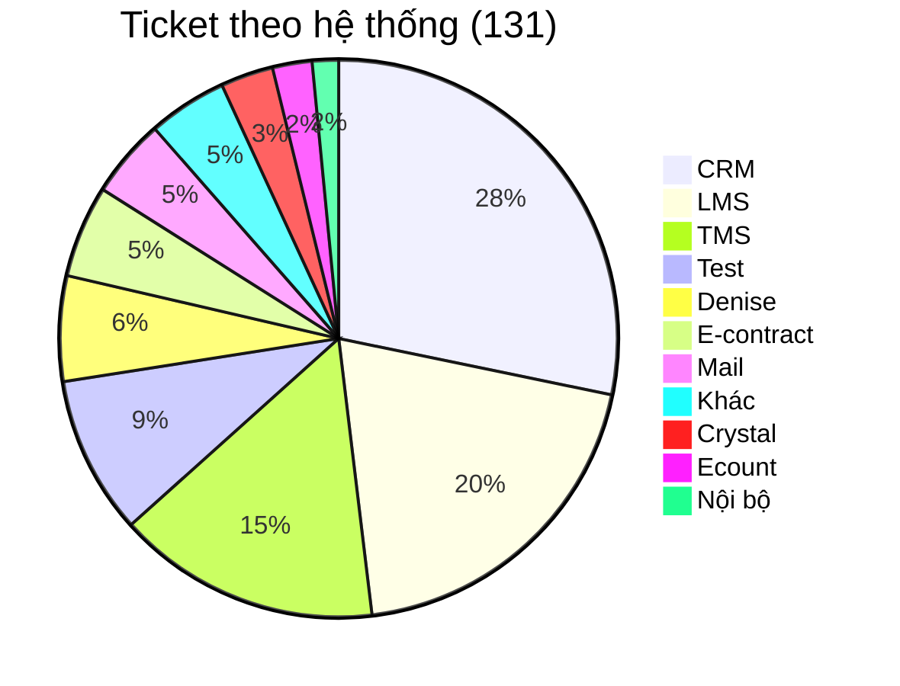
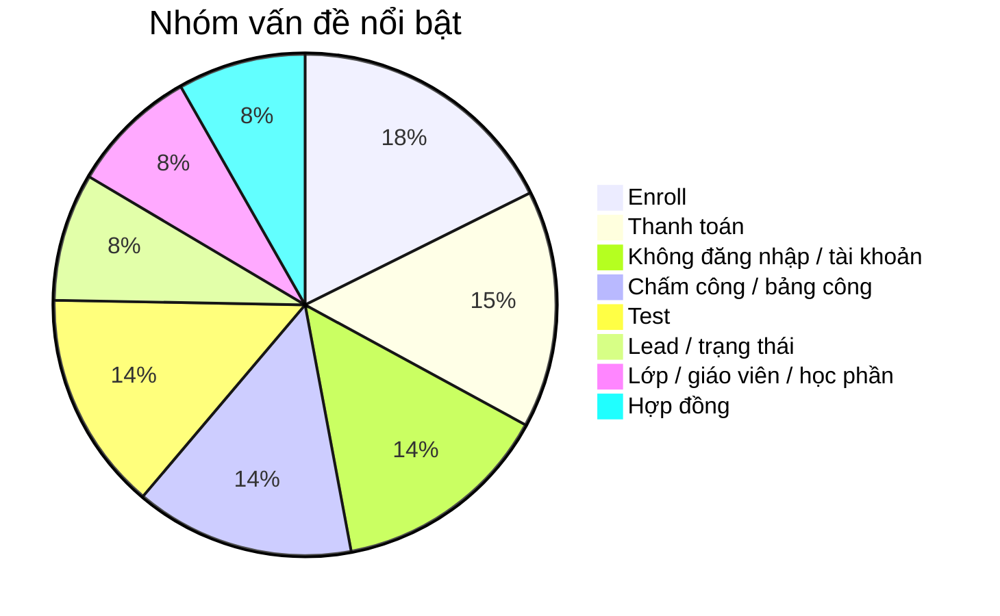
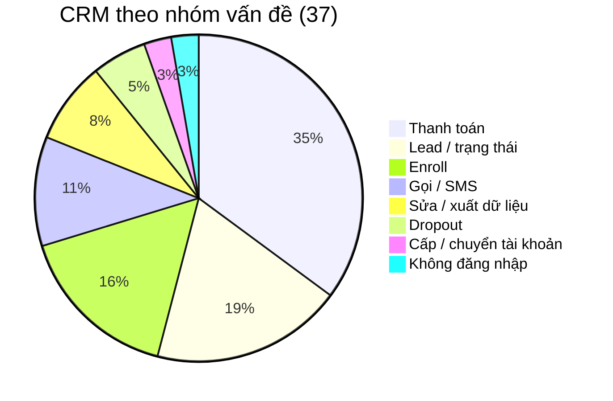
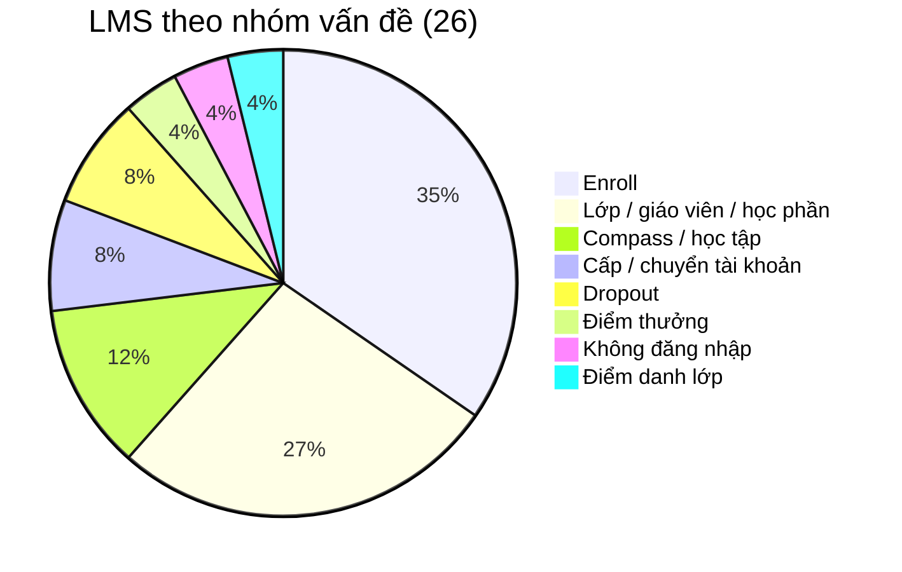
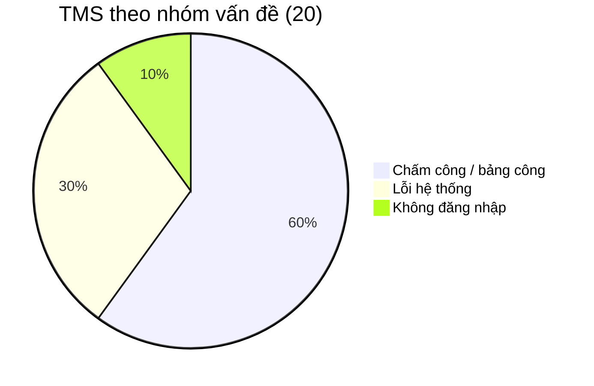
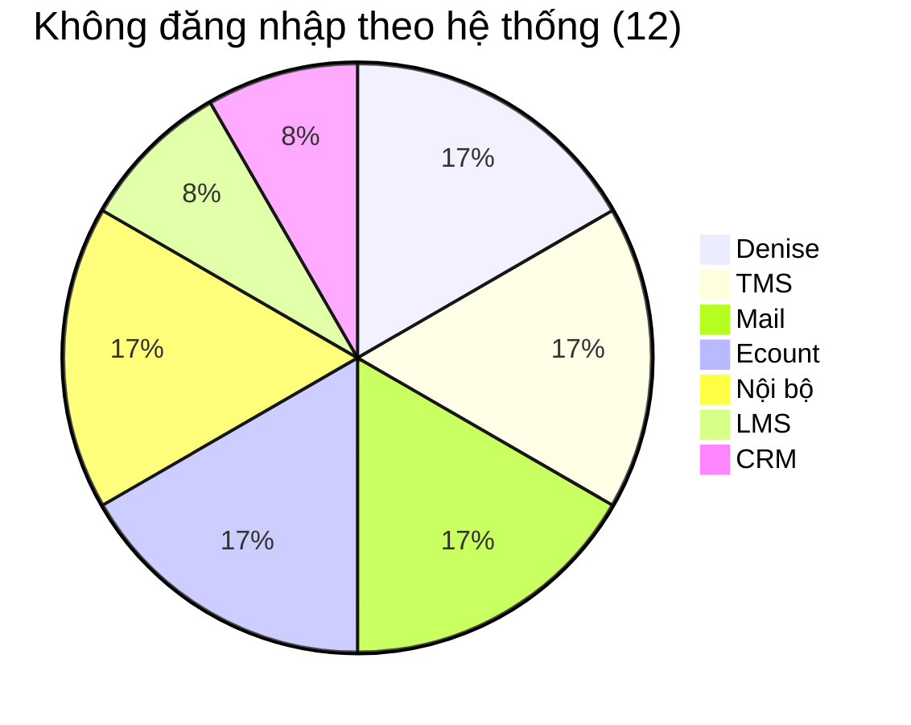
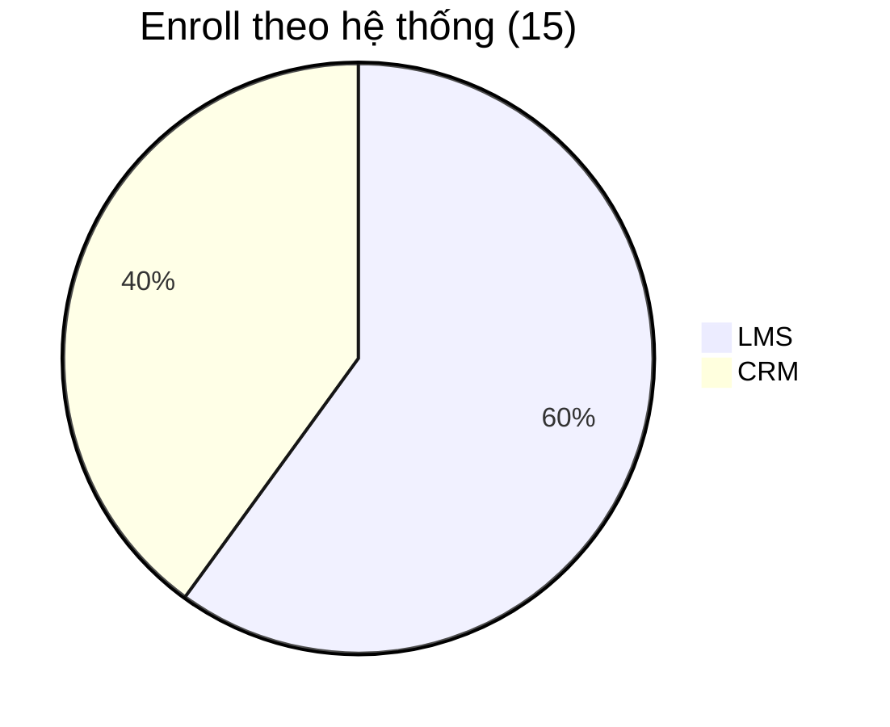
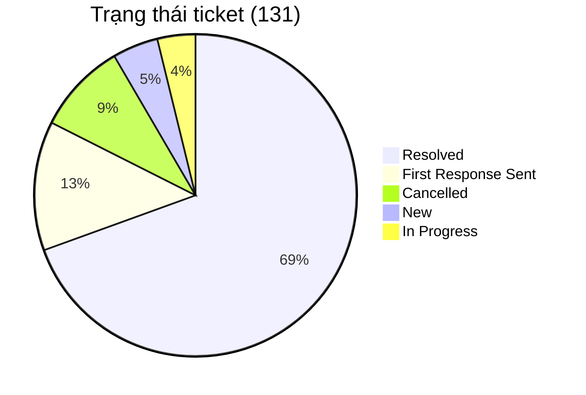
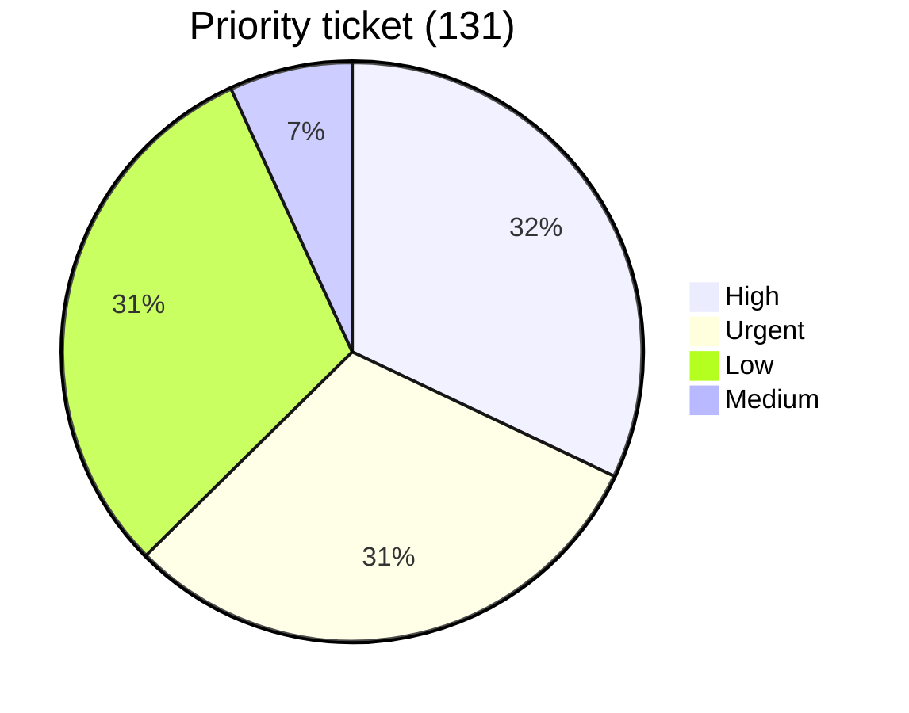

# Báo cáo phân tích ticket sample - Technical Support

**Nguồn dữ liệu:** `docs/plans/week-5/data/sample.xlsx`  
**Sheet:** `sheet1`  
**Phạm vi:** ticket Helpdesk team `Technical Support` trong file sample Week 5  
**Kết quả sau khi gom ID:** 131 ticket không trùng lặp

---

## 1. Cách đọc dữ liệu

File Excel có **183 dòng**, nhưng không phải mỗi dòng là một ticket. Một số dòng là dòng group theo trạng thái, một số dòng là tag phụ của ticket phía trên. Vì vậy report này đếm theo cột `Ticket IDs Sequence`, sau đó gom thêm các tag phụ vào cùng ticket.

Cách xử lý:

1. Bỏ các dòng group như `New (6)`, `Resolved (91)`, `Cancelled (12)`.
2. Mỗi dòng có `Ticket IDs Sequence` được tính là một ticket chính.
3. Các dòng bên dưới không có ticket ID nhưng có `Tags` được gom vào ticket gần nhất.
4. Phân loại ticket bằng `Subject` + `Tags`.
5. Đếm theo 4 góc nhìn: hệ thống, nhóm vấn đề, trạng thái và priority.

---

## 2. Kết luận nhanh

Từ 131 ticket sample, khối lượng support tập trung chủ yếu ở **CRM, LMS và TMS**. Ba hệ thống này chiếm **83/131 ticket**, tương đương khoảng **63,4%** tổng số ticket.

Các nhóm vấn đề nổi bật nhất là:

- **Enroll:** 15 ticket
- **Thanh toán:** 13 ticket
- **Không đăng nhập / tài khoản:** 12 ticket
- **Chấm công / bảng công:** 12 ticket
- **Test:** 12 ticket

Insight quan trọng: **nhóm có nhiều ticket chưa chắc là nhóm nên auto trước**. Thanh toán và thay đổi dữ liệu CRM có volume cao nhưng rủi ro nghiệp vụ lớn. Login/tài khoản có volume vừa đủ, quy trình kiểm tra lặp lại, và phù hợp hơn để thử automation có guardrail.

---

## 3. Phân bố ticket theo hệ thống

| Hệ thống / nhóm | Số ticket | Tỷ lệ | Nhận xét |
| --- | ---: | ---: | --- |
| CRM | 37 | 28,2% | Lớn nhất, nhiều nghiệp vụ thanh toán/lead/enroll |
| LMS | 26 | 19,8% | Nhiều ticket enroll, lớp, giáo viên, học phần |
| TMS | 20 | 15,3% | Chủ yếu chấm công, bảng công và lỗi thao tác |
| Test | 12 | 9,2% | Ticket phục vụ test luồng email/ticket |
| Denise | 8 | 6,1% | Đăng nhập Denise, đối chiếu điểm/quà |
| E-contract | 7 | 5,3% | Hợp đồng, ký hợp đồng, sai thông tin |
| Mail | 6 | 4,6% | Mail contact, email công việc, email TMS |
| Khác | 6 | 4,6% | Các case rời rạc chưa đủ thành nhóm lớn |
| Crystal | 4 | 3,1% | Phòng/event/booking |
| Ecount | 3 | 2,3% | Tài khoản Ecount, đối chiếu số liệu |
| Nội bộ | 2 | 1,5% | Đăng nhập hệ thống nội bộ |

Nhìn theo hệ thống, CRM là vùng có volume cao nhất. Nhưng phần lớn CRM liên quan đến dữ liệu nhạy cảm như payment, lead, order và hợp đồng, nên không nên chọn auto thay đổi dữ liệu nếu chưa có quyền xử lý và rule kiểm soát rõ.

---

## 4. Nhóm vấn đề xuất hiện nhiều nhất

| Nhóm vấn đề | Số ticket | Nhận xét |
| --- | ---: | --- |
| Enroll | 15 | Xuất hiện ở cả LMS và CRM, cần chuẩn hóa thông tin lớp/học viên |
| Thanh toán | 13 | Tập trung ở CRM, rủi ro cao vì liên quan tiền/giao dịch |
| Không đăng nhập / tài khoản | 12 | Rải trên nhiều hệ thống, phù hợp để đánh giá automation support |
| Chấm công / bảng công | 12 | Tập trung ở TMS, cần xác định phạm vi ảnh hưởng |
| Test | 12 | Không phản ánh nhu cầu support thật |
| Lead / trạng thái | 7 | CRM, thường cần hiểu nghiệp vụ sale/CS |
| Lớp / giáo viên / học phần | 7 | LMS, thường cần kiểm tra dữ liệu lớp hoặc quyền |
| Hợp đồng | 7 | E-contract/CRM, rủi ro nghiệp vụ và pháp lý cao hơn |

---

## 5. Phân tích theo hệ thống chính

### 5.1. CRM - 37 ticket

CRM là hệ thống có số ticket lớn nhất, chiếm **37/131 ticket (~28,2%)**. Nhóm lớn nhất bên trong CRM là **thanh toán** với 13 ticket, gồm tạo QR, gỡ payment, hủy/confirm giao dịch, cập nhật trạng thái đóng tiền, hóa đơn và mã giảm giá.

Nhóm **lead / trạng thái** có 7 ticket, thường liên quan đến chuyển trạng thái lead, assign/import lead hoặc sửa dữ liệu trên CRM. Nhóm **enroll** có 6 ticket, giao giữa nghiệp vụ CRM và LMS.

Đánh giá automation: CRM có volume cao nhưng nhiều thao tác có side effect lớn. Với payment, order, lead hoặc hợp đồng, automation nên dừng ở mức phân loại, kiểm tra thiếu thông tin, tạo note hoặc routing. Không nên tự sửa dữ liệu nếu chưa có rule duyệt và quyền xử lý rõ.

---

### 5.2. LMS - 26 ticket

LMS có **26 ticket (~19,8%)**, đứng thứ hai sau CRM. Nhóm lớn nhất là **enroll** với 9 ticket: thêm học viên vào lớp, lỗi enroll, enroll trùng, không tìm thấy lớp hoặc slot.

Nhóm **lớp / giáo viên / học phần** có 7 ticket, gồm thêm giáo viên, điều chỉnh lớp, học phần hoặc thông tin lớp học. Những ticket này có thể xử lý nhanh hơn nếu form đầu vào bắt buộc có mã lớp, tên học viên/giáo viên, số điện thoại hoặc mã user, và mô tả thao tác đã thử.

Đánh giá automation: LMS phù hợp để làm checklist và routing. Một số case tài khoản có thể auto nếu rule rõ. Nhưng enroll/lớp/học phần vẫn cần cẩn thận vì có thể thay đổi dữ liệu học tập thật.

---

### 5.3. TMS - 20 ticket

TMS có **20 ticket (~15,3%)**. Nhóm lớn nhất là **chấm công / bảng công** với 12 ticket: không hiện công, không duyệt được công, lỗi bù công, đi đúng ca nhưng bị báo trễ, và các vấn đề điểm danh/chấm công giáo viên.

Có 6 ticket lỗi hệ thống TMS như mất dữ liệu, không hiển thị thông tin hoặc không thao tác được. Các ticket có cùng thời điểm, khu vực hoặc triệu chứng nên được kiểm tra khả năng phát sinh từ cùng một incident trước khi xử lý rời rạc.

Đánh giá automation: không nên auto sửa dữ liệu công. Hướng phù hợp là gom ticket cùng pattern, tạo incident chính, cập nhật chung và escalate Dev/ops phụ trách TMS.

---

## 6. Vấn đề xuất hiện trên nhiều hệ thống

### 6.1. Không đăng nhập / tài khoản - 12 ticket

Nhóm login/tài khoản không tập trung ở một hệ thống duy nhất mà rải trên 7 hệ thống. Điều này cho thấy vấn đề tài khoản là pattern vận hành chung: user không vào được hệ thống, quên mật khẩu, bị khóa tài khoản hoặc cần cấp lại tài khoản.

Nhóm này phù hợp để thử automation hơn payment/enroll vì workflow kiểm tra thường lặp:

- Xác định hệ thống user không đăng nhập được.
- Xác định email hoặc mã user cần kiểm tra.
- Kiểm tra trạng thái account.
- Nếu đủ rule thì xử lý, nếu không thì chuyển support.

Với bài Week 5, tool login LMS chỉ nên xử lý phần nằm trong phạm vi LMS. Các hệ thống khác như Denise, TMS, Ecount, Mail hoặc hệ thống nội bộ cần workflow riêng hoặc routing sang đúng owner.

---

### 6.2. Enroll - 15 ticket

Enroll xuất hiện ở cả LMS và CRM. Vấn đề thường gặp là thêm học viên vào lớp, không tìm thấy lớp/slot, lỗi enroll hoặc sửa thông tin enrollment.

Hướng cải thiện trước mắt không phải auto enroll ngay, mà là chuẩn hóa thông tin đầu vào:

- Mã lớp
- Tên học viên
- Số điện thoại hoặc mã học viên
- Hệ thống đang thao tác: CRM hay LMS
- Lỗi cụ thể hoặc screenshot

Khi dữ liệu đầu vào đủ chuẩn, support/dev sẽ giảm thời gian hỏi lại và có thể viết SOP riêng cho CRM enroll và LMS enroll.

---

### 6.3. Thanh toán - 13 ticket

13 ticket thanh toán đều thuộc CRM. Đây là nhóm có volume cao nhưng liên quan trực tiếp đến tiền, order, mã giảm giá, trạng thái đóng tiền hoặc giao dịch.

Vì vậy hướng automation phù hợp là:

- Kiểm tra ticket đã đủ mã lead/order/giao dịch chưa.
- Nhắc user bổ sung số tiền, mã giao dịch, nội dung cần xử lý.
- Route tới kế toán hoặc người có quyền.
- Ghi note chuẩn để tránh mất context.

Không nên để tool tự hủy payment, confirm giao dịch hoặc sửa trạng thái đóng tiền khi chưa có quy trình duyệt rõ ràng.

---

## 7. Trạng thái và priority

Trạng thái được lấy từ các dòng group trong Excel, không lấy từ cột `Kanban State` vì cột này trong file sample đều hiển thị `In progress`.

Có **91/131 ticket đã Resolved**, tương đương khoảng **69,5%**. Số ticket còn lại nằm ở các trạng thái First Response Sent, Cancelled, New và In Progress.

Nhóm **High + Urgent có 82 ticket**, chiếm khoảng **62,6%** tổng số ticket. Tuy nhiên, priority không đủ để kết luận impact thật, vì file không cho biết mỗi ticket ảnh hưởng bao nhiêu user hoặc có phải incident chung hay không.

---

## 8. Đề xuất hướng xử lý

### CRM - Thanh toán

Chuẩn hóa form tạo ticket với các trường bắt buộc: mã lead/order, mã giao dịch, số tiền, trạng thái hiện tại và thao tác cần hỗ trợ. Automation chỉ nên phân loại/routing, không tự sửa dữ liệu thanh toán.

### LMS/CRM - Enroll

Tách SOP cho LMS enroll và CRM enroll. Form ticket cần có mã lớp, học viên, số điện thoại/mã user, hệ thống gặp lỗi và ảnh chụp màn hình. Chỉ cân nhắc automation khi rule enroll đủ rõ và có cơ chế review.

### TMS - Chấm công

Xác định phạm vi ảnh hưởng trước khi xử lý: một nhân sự, một lớp/ca, một cơ sở hay toàn hệ thống. Nếu nhiều ticket cùng thời điểm/triệu chứng thì gom thành incident chung.

### Login / tài khoản

Đây là nhóm phù hợp nhất để tiếp tục đánh giá automation. Nhưng workflow cần giới hạn theo từng hệ thống. Với LMS, chỉ nên auto khi đủ điều kiện như user còn active và account LMS bị deactivate. Các trường hợp thiếu định danh, không tìm thấy account, user inactive hoặc nghi lỗi hệ thống cần chuyển review.

### Test ticket

Không dùng nhóm test để kết luận nhu cầu support thật. Khi tính workload thực tế nên tách riêng hoặc loại khỏi report production.

---

## 9. Kết luận

Phân tích `sample.xlsx` cho thấy 131 ticket sample tập trung chủ yếu ở **CRM, LMS và TMS**, chiếm **63,4%** tổng số ticket. Các nhóm vấn đề nổi bật là **enroll, thanh toán, không đăng nhập/tài khoản và chấm công**.

Nếu chỉ nhìn volume, CRM thanh toán và enroll là các nhóm rất lớn. Nhưng xét rủi ro automation, các nhóm này liên quan đến tiền, dữ liệu học tập hoặc quy trình nghiệp vụ nên chưa phù hợp để auto thay đổi dữ liệu.

Nhóm login/tài khoản tuy không phải nhóm lớn nhất tuyệt đối, nhưng có quy trình kiểm tra lặp và có thể đặt guardrail rõ. Vì vậy hướng chọn tool login LMS cho Week 5 là hợp lý: bắt đầu từ một phần nhỏ, rõ điều kiện, ít side effect hơn, rồi đo hiệu quả thực tế trước khi mở rộng.
