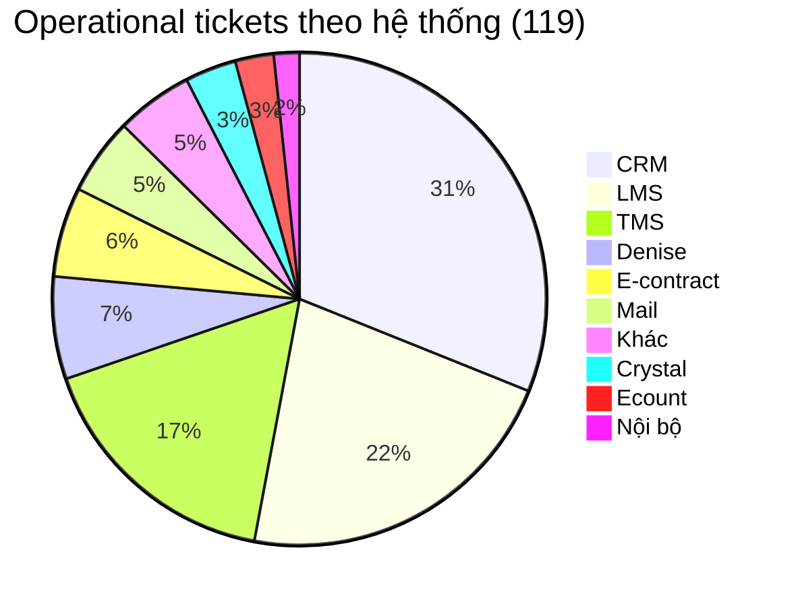
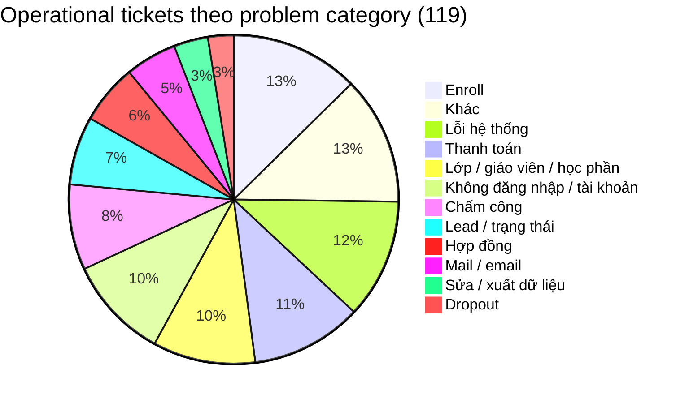
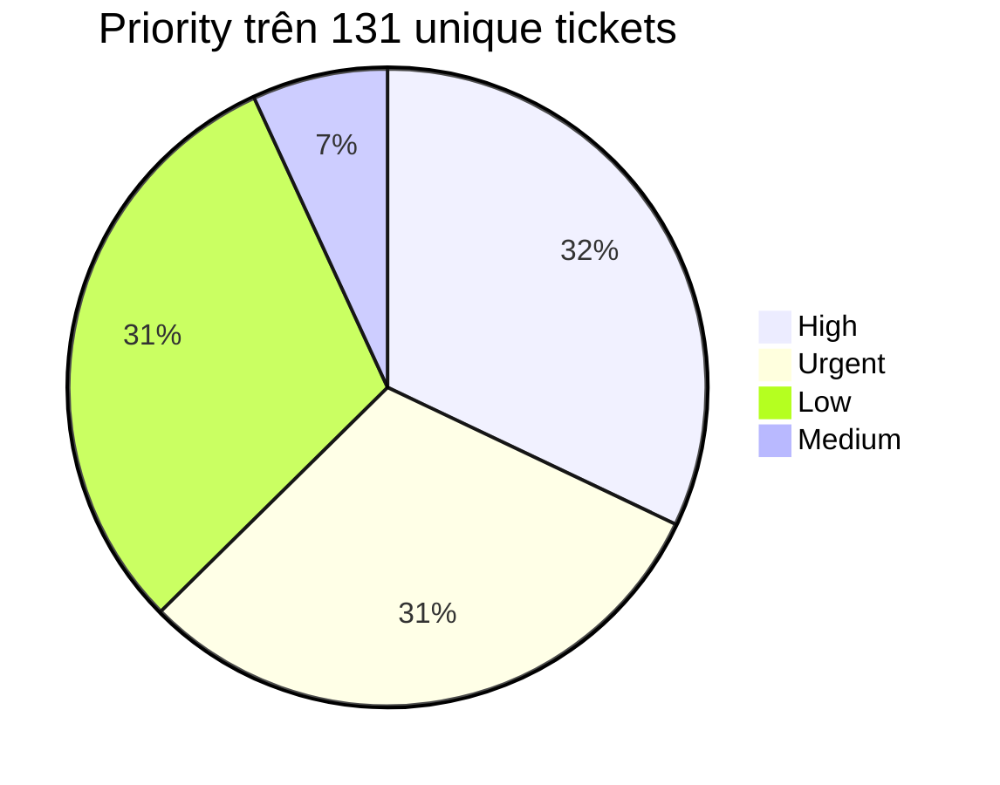

# Báo cáo phân tích ticket sample - từ dữ liệu đến quyết định vận hành

**Nguồn dữ liệu:** `docs/plans/week-5/data/sample.xlsx`  
**Phạm vi:** Helpdesk team `Technical Support` trong file sample Week 5  
**Mục tiêu:** không chỉ mô tả ticket xuất hiện ở đâu, mà dùng data để quyết định nhóm vấn đề nào nên viết FAQ/SOP, nhóm nào cần routing/human review, và nhóm nào đủ điều kiện để thử automation an toàn.

---

## 1. Executive summary

File Excel có **183 dòng raw**, sau khi làm sạch còn **131 ticket unique**. Trong 131 ticket này có **12 test ticket**, không phản ánh workload support thật. Vì vậy phần operational analysis dùng mẫu số chính là:

**119 operational support tickets = 131 unique tickets - 12 test tickets**

Ba hệ thống tạo workload lớn nhất là **CRM, LMS và TMS**, chiếm **83/119 operational tickets (~69,7%)**.

Các nhóm vấn đề đáng chú ý nhất theo working classification từ `Subject + Tags`:

- **Enroll:** 15 ticket
- **Lỗi hệ thống:** 14 ticket
- **Thanh toán:** 13 ticket
- **Lớp / giáo viên / học phần:** 12 ticket
- **Không đăng nhập / tài khoản:** 12 ticket

Kết luận vận hành chính:

1. **CRM Payment** có volume cao và priority đáng kể, nhưng không nên auto sửa dữ liệu vì liên quan tiền/giao dịch.
2. **Enroll** có volume cao và backlog tương đối rõ, nên ưu tiên chuẩn hóa input + SOP trước khi nghĩ tới automation.
3. **Login/Account** không phải nhóm lớn nhất, nhưng có workflow kiểm tra lặp, phạm vi có thể giới hạn và dễ đặt guardrail hơn.
4. **Automation chỉ là một loại intervention**, không phải đáp án cho mọi nhóm ticket.

---

## 2. Data preparation

### 2.1. Raw data to clean data

File `sample.xlsx` không thể đếm trực tiếp theo số dòng Excel vì có nhiều loại dòng:

- Dòng group theo trạng thái như `New (6)`, `Resolved (91)`, `Cancelled (12)`.
- Dòng ticket chính có `Ticket IDs Sequence`.
- Dòng tag phụ không có ticket ID, cần gom về ticket gần nhất.

Quy trình cleaning:

1. Bỏ các dòng group.
2. Dùng `Ticket IDs Sequence` làm khóa ticket.
3. Gom các dòng tag phụ vào cùng ticket.
4. Tách ticket test khỏi operational ticket.
5. Phân loại bằng `Subject + Tags`.

### 2.2. Dataset sau cleaning

| Layer | Số lượng | Cách dùng |
| --- | ---: | --- |
| Raw Excel rows | 183 | Không dùng làm ticket count |
| Unique tickets | 131 | Dùng để kiểm tra tổng dataset |
| Test tickets | 12 | Tách riêng, không dùng để đánh giá workload thật |
| Operational support tickets | 119 | Mẫu số chính cho workload analysis |

### 2.3. Vì sao phải tách test ticket?

Nếu dùng 131 ticket làm mẫu số chính, workload thật sẽ bị pha với ticket test. Ví dụ CRM + LMS + TMS có **83 ticket**:

- Tính trên 131 unique tickets: **83/131 = 63,4%**
- Tính trên 119 operational tickets: **83/119 = 69,7%**

Vì mục tiêu là phân tích workload Technical Support, các phần sau dùng **119 operational tickets** làm denominator chính.

---

## 3. Data limitations

Dataset hiện tại đủ để phân tích **ticket frequency**, nhưng chưa đủ để kết luận đầy đủ về **support workload** hoặc **business impact**.

File chưa có các trường quan trọng sau:

- Resolution time
- First response time
- SLA breached hay không
- Number of interactions / số lần trao đổi
- Reopen count
- Assignee / owner xử lý
- Number of affected users
- Incident relationship
- Description đầy đủ
- Comment hoặc resolution history
- Actual resolution action

Vì vậy report này phân biệt rõ:

| Loại kết luận | Có thể kết luận từ data hiện tại không? | Ghi chú |
| --- | --- | --- |
| Ticket xuất hiện nhiều ở đâu | Có | Dựa vào `Subject`, `Tags`, system grouping |
| Nhóm nào có nhiều ticket chưa resolved | Có tương đối | Dựa vào stage group trong Excel |
| Nhóm nào hay có priority cao | Có | Dựa vào priority field |
| Nhóm nào tốn nhiều effort nhất | Chưa đủ | Cần resolution time và số interaction |
| Nhóm nào có impact business lớn nhất | Chưa đủ | Cần số user affected và incident mapping |
| Root cause distribution | Chưa đủ | Cần description/comment/resolution history |

---

## 4. Where is the workload?

Sau khi tách 12 test ticket, operational workload phân bố theo hệ thống như sau:

| Hệ thống / nhóm | Số ticket | Tỷ lệ trên 119 operational tickets | Insight |
| --- | ---: | ---: | --- |
| CRM | 37 | 31,1% | Vùng workload lớn nhất, nhiều case payment/lead/enroll |
| LMS | 26 | 21,8% | Nhiều case enroll, lớp, giáo viên, học phần |
| TMS | 20 | 16,8% | Tập trung vào chấm công, bảng công và lỗi thao tác |
| Denise | 8 | 6,7% | Có pattern tài khoản/đối chiếu điểm quà |
| E-contract | 7 | 5,9% | Liên quan hợp đồng, cần human review cao |
| Mail | 6 | 5,0% | Chủ yếu tài khoản/mail contact/email công việc |
| Khác | 6 | 5,0% | Các case rời rạc |
| Crystal | 4 | 3,4% | Booking/phòng/event |
| Ecount | 3 | 2,5% | Tài khoản hoặc đối chiếu số liệu |
| Nội bộ | 2 | 1,7% | Login hệ thống nội bộ |

**Decision insight:** CRM, LMS, TMS là nơi nên ưu tiên cải thiện operation vì tạo gần 70% workload thật. Nhưng mỗi hệ thống cần loại intervention khác nhau, không nên mặc định dùng automation.

---

## 5. What creates the workload?

Problem category dưới đây là **working classification** dựa trên `Subject + Tags`. Đây chưa phải root cause. Một ticket có thể chạm nhiều nghiệp vụ, nhưng report gán vào nhóm chính để phục vụ decision-making.

| Problem category | Total | Nhận xét |
| --- | ---: | --- |
| Enroll | 15 | Volume cao, xuất hiện ở CRM/LMS, cần form input chuẩn |
| Khác | 15 | Nhóm rời rạc, chưa đủ coherent để auto |
| Lỗi hệ thống | 14 | Cần incident detection/escalation hơn là auto-resolve |
| Thanh toán | 13 | Volume cao nhưng rủi ro tài chính lớn |
| Lớp / giáo viên / học phần | 12 | Cần SOP và dữ liệu lớp/học viên rõ |
| Không đăng nhập / tài khoản | 12 | Candidate tốt cho SOP + automation có guardrail |
| Chấm công | 10 | Liên quan TMS, cần kiểm tra phạm vi ảnh hưởng |
| Lead / trạng thái | 8 | Cần hiểu nghiệp vụ CRM, không nên tự đổi trạng thái bừa |
| Hợp đồng | 7 | Rủi ro nghiệp vụ/pháp lý, cần human review |
| Mail / email | 6 | Có thể chuẩn hóa checklist tài khoản/mail |
| Sửa / xuất dữ liệu | 4 | Ít nhưng có backlog cao, cần owner rõ |
| Dropout | 3 | Cần rule nghiệp vụ, không ưu tiên automation |

**Decision insight:** top volume không tự động đồng nghĩa với top automation candidate. Payment và enroll lớn, nhưng tác động dữ liệu thật. Login/account ít rủi ro hơn nếu giới hạn action rõ.

---

## 6. Which problems are creating backlog?

Resolved rate tổng thể của dataset là **91/131 unique tickets (~69,5%)**. Nhưng nhìn tổng thể như vậy chưa đủ. Cần xem nhóm nào đang còn unresolved.

Bảng dưới dùng 119 operational tickets, loại test khỏi analysis.

| Problem category | Total | Resolved | Unresolved | Unresolved rate |
| --- | ---: | ---: | ---: | ---: |
| Enroll | 15 | 10 | 5 | 33,3% |
| Khác | 15 | 14 | 1 | 6,7% |
| Lỗi hệ thống | 14 | 12 | 2 | 14,3% |
| Thanh toán | 13 | 9 | 4 | 30,8% |
| Lớp / giáo viên / học phần | 12 | 7 | 5 | 41,7% |
| Không đăng nhập / tài khoản | 12 | 9 | 3 | 25,0% |
| Chấm công | 10 | 10 | 0 | 0,0% |
| Lead / trạng thái | 8 | 6 | 2 | 25,0% |
| Hợp đồng | 7 | 6 | 1 | 14,3% |
| Mail / email | 6 | 5 | 1 | 16,7% |
| Sửa / xuất dữ liệu | 4 | 1 | 3 | 75,0% |
| Dropout | 3 | 2 | 1 | 33,3% |

Backlog insight:

- **Lớp / giáo viên / học phần** có unresolved rate cao trong nhóm volume vừa: 5/12.
- **Enroll** có 5 unresolved ticket, nên đây là nhóm cần chuẩn hóa input/SOP sớm.
- **Thanh toán** có 4 unresolved ticket, nhưng không nên auto vì rủi ro tài chính.
- **Sửa / xuất dữ liệu** chỉ có 4 ticket nhưng 3 unresolved, cho thấy có thể bị kẹt vì thiếu owner/quyền xử lý.
- **Chấm công** có 10 ticket nhưng đều resolved trong sample, nên không phải backlog chính ở snapshot này.

---

## 7. Which problems are high priority?

Priority tổng thể:

Nhóm **High + Urgent = 82/131 ticket (~62,6%)**. Nhưng để ra quyết định, cần nối priority với problem category.

| Problem category | Low | Medium | High | Urgent | High + Urgent |
| --- | ---: | ---: | ---: | ---: | ---: |
| Enroll | 4 | 1 | 6 | 4 | 10 |
| Khác | 2 | 1 | 5 | 7 | 12 |
| Lỗi hệ thống | 4 | 1 | 3 | 6 | 9 |
| Thanh toán | 5 | 0 | 5 | 3 | 8 |
| Lớp / giáo viên / học phần | 2 | 1 | 5 | 4 | 9 |
| Không đăng nhập / tài khoản | 5 | 1 | 4 | 2 | 6 |
| Chấm công | 2 | 1 | 4 | 3 | 7 |
| Lead / trạng thái | 0 | 1 | 4 | 3 | 7 |
| Hợp đồng | 4 | 0 | 2 | 1 | 3 |
| Mail / email | 1 | 0 | 0 | 5 | 5 |
| Sửa / xuất dữ liệu | 0 | 0 | 2 | 2 | 4 |
| Dropout | 0 | 1 | 2 | 0 | 2 |

Priority insight:

- **Enroll** vừa volume cao vừa có 10 High/Urgent ticket.
- **Lỗi hệ thống** có 9 High/Urgent ticket, nên cần incident/escalation tốt.
- **Thanh toán** có 8 High/Urgent ticket, nhưng cần human approval.
- **Login/account** có 6 High/Urgent ticket, không lớn nhất nhưng vẫn đủ đáng chú ý.
- **Mail/email** chỉ 6 ticket nhưng có 5 Urgent, nên có thể cần routing/owner rõ hơn.

---

## 8. Root cause và hypothesis

### 8.1. Observation từ data

Data hiện tại cho phép quan sát:

- Có **12 ticket không đăng nhập / tài khoản**.
- Pattern này rải trên nhiều hệ thống: Denise, TMS, Mail, Ecount, hệ thống nội bộ, LMS và CRM.
- Ticket title cho thấy các triệu chứng như không đăng nhập được, quên mật khẩu, tài khoản bị khóa hoặc cần cấp lại tài khoản.

### 8.2. Điều data chưa chứng minh được

`Subject + Tags` chỉ đủ để xác định **problem category**, chưa đủ để xác định **root cause distribution**.

Ví dụ cùng là “không đăng nhập được” nhưng root cause có thể là:

- Account bị deactivate.
- Chưa có account.
- Sai password.
- Account bị lock.
- Sai permission.
- User không còn active.
- System error.
- User dùng sai email đăng nhập.

Các root cause này dẫn tới workflow xử lý khác nhau. Vì vậy không nên kết luận thẳng:

**12 login tickets -> automation login chắc chắn hiệu quả**

Cách lập luận chặt hơn là:

**12 login tickets -> có pattern login/account -> hypothesis về workflow lặp -> cần validate bằng description/comment/resolution history -> nếu workflow lặp và rule rõ thì làm automation candidate.**

### 8.3. Operational hypothesis

Hypothesis hợp lý:

> Login/account có khả năng là nhóm phù hợp để chuẩn hóa bằng SOP và thử automation có guardrail, vì các bước kiểm tra thường có thể giới hạn theo account status, HR status và hệ thống liên quan.

Validation cần thêm:

- Mỗi ticket login được xử lý bằng action gì?
- Bao nhiêu case là deactivate?
- Bao nhiêu case chỉ cần reset password?
- Bao nhiêu case thiếu thông tin?
- Bao nhiêu case phải escalate Dev?
- Average handling time hiện tại là bao lâu?

---

## 9. Intervention mapping

Không phải nhóm nào cũng cần automation. Dựa trên volume, priority, unresolved rate, risk và khả năng chuẩn hóa, có thể map intervention như sau:

| Problem | Tín hiệu từ data | Rủi ro nếu auto sai | Intervention phù hợp |
| --- | --- | --- | --- |
| Thanh toán | 13 ticket, 8 High/Urgent, 4 unresolved | Cao: tiền, giao dịch, order | Form validation + routing + human approval |
| Enroll | 15 ticket, 10 High/Urgent, 5 unresolved | Trung bình/cao: dữ liệu lớp và học viên | Input validation + SOP + review |
| Lỗi hệ thống | 14 ticket, 9 High/Urgent | Cao: có thể là incident chung | Incident detection + escalation |
| Lớp / giáo viên / học phần | 12 ticket, 5 unresolved | Trung bình: dữ liệu lớp/học phần | SOP + checklist + routing |
| Login/account | 12 ticket, 6 High/Urgent, 3 unresolved | Có thể kiểm soát nếu guardrail rõ | SOP + limited automation candidate |
| Chấm công | 10 ticket, 7 High/Urgent, 0 unresolved | Cao: dữ liệu công/lương | Incident grouping + human review |
| Hợp đồng | 7 ticket | Cao: nghiệp vụ/pháp lý | Routing + human approval |
| Mail/email | 6 ticket, 5 Urgent | Trung bình: quyền truy cập | Checklist + routing |
| Test | 12 ticket | Không phải workload thật | Tách khỏi operational analysis |

Decision:

- **FAQ/SOP:** login hướng dẫn, mail/email, enroll checklist.
- **Input validation:** enroll, payment, class/teacher/module.
- **Routing/human approval:** payment, contract, lead/status.
- **Incident management:** TMS, system error, repeated same symptom.
- **Automation candidate:** login/account, nhưng chỉ ở nhánh có rule rõ.

---

## 10. Vì sao vẫn chọn Login LMS cho Week 5?

Nếu chỉ nhìn file sample, login/account có **12 operational tickets**, không phải nhóm lớn nhất. Enroll, system error và payment đều có volume bằng hoặc cao hơn.

Nhưng quyết định chọn automation không dựa trên volume một mình. Em đánh giá theo các tiêu chí sau:

| Tiêu chí | Payment | Enroll | System error / TMS | Login/account |
| --- | --- | --- | --- | --- |
| Volume | Cao | Cao | Cao/vừa | Vừa |
| Repeatability | Có một phần | Có một phần | Thấp, tùy sự cố | Cao hơn |
| Detectability từ ticket | Trung bình | Trung bình | Thấp/trung bình | Tương đối rõ |
| Side effect nếu auto sai | Cao | Trung bình/cao | Cao | Có thể giới hạn |
| Guardrail | Khó hơn | Cần rule nghiệp vụ | Khó vì cần root cause | Dễ đặt hơn |
| Phù hợp demo Week 5 | Không nên auto data tiền | Chưa nên auto enroll | Nên escalate | Phù hợp nhất |

Với bài Week 5, chọn **Login LMS** là hợp lý nếu scope được giới hạn:

- Chỉ xử lý ticket login thuộc LMS.
- Chỉ auto khi xác định được user.
- Chỉ reactivate khi user còn active và LMS account bị deactivate.
- Không tự tạo account mới.
- Không tự xử lý nếu thiếu email/định danh của tài khoản LMS cần kiểm tra.
- Không tự xử lý nếu nghi lỗi hệ thống.

Nói chính xác hơn:

> Sample data không chứng minh Login LMS là nhóm có volume lớn nhất. Sample data chứng minh Login/Account là một pattern vận hành có thể chuẩn hóa. Việc chọn LMS là do phạm vi implementation của Week 5 nhỏ hơn, có thể mock HR/LMS và đặt guardrail rõ hơn so với payment/enroll.

---

## 11. Success metrics

Để biết automation có thật sự cải thiện operation không, cần đo baseline trước và sau triển khai.

### 11.1. Baseline cần có trước automation

Các chỉ số nên thu thập từ ticket login/account:

- Average handling time / thời gian xử lý trung bình.
- First response time.
- Resolution rate.
- Số bước manual trên mỗi ticket.
- Tỷ lệ ticket thiếu thông tin phải hỏi lại.
- Tỷ lệ ticket phải escalate support/Dev.
- Số lần reopen.
- Nhóm root cause: deactivate, quên mật khẩu, thiếu account, inactive user, system error.

### 11.2. Metrics sau automation

Sau khi chạy tool, cần đo:

- Automation coverage: bao nhiêu ticket login được tool nhận diện.
- Auto-resolution rate: bao nhiêu ticket được xử lý tự động thành công.
- Handoff rate: bao nhiêu ticket chuyển `NEED_REVIEW`.
- Skip rate: bao nhiêu ticket bị `SKIP` do thiếu dữ liệu hoặc ngoài scope.
- Error rate: tool xử lý lỗi bao nhiêu lần.
- False action rate: số lần tool tác động sai account hoặc sai case.
- Average handling time sau automation.

### 11.3. Cách đọc kết quả

Automation chỉ được coi là hiệu quả nếu:

- Giảm thời gian xử lý trung bình.
- Giảm thao tác lặp của support.
- Không tăng false action.
- Không làm mất context khi handoff sang người.
- Có log rõ để audit lại decision của tool.

---

## 12. Next analysis

Để nâng report từ hypothesis lên decision chắc hơn, cần bổ sung data ở vòng tiếp theo:

1. Export thêm `Description`, comment và resolution note.
2. Gắn root cause cho từng ticket login/account.
3. Đo handling time trước automation.
4. Chạy tool với scope hẹp trên LMS login.
5. So sánh metrics trước/sau.
6. Nếu hiệu quả và không có false action, mới cân nhắc mở rộng sang nhóm account khác.

---

## 13. Kết luận

Report này không dừng ở việc mô tả ticket xuất hiện ở đâu. Mục tiêu là biến dữ liệu ticket thành quyết định vận hành:

**Data -> Pattern -> Impact -> Root cause hypothesis -> Intervention -> Measurement**

Từ `sample.xlsx`, workload thật sau khi tách test là **119 operational tickets**. CRM, LMS và TMS chiếm gần **70%** operational workload. Các nhóm Enroll, Payment, System Error và Login/Account đều đáng chú ý, nhưng cần cách xử lý khác nhau.

Payment và Enroll có volume cao nhưng liên quan đến dữ liệu tiền, lead, lớp và học viên nên ưu tiên form validation, SOP, routing và human review. System Error/TMS nên ưu tiên incident grouping và escalation. Login/Account là candidate hợp lý hơn cho automation có guardrail vì workflow có thể giới hạn và kiểm tra bằng dữ liệu trạng thái account.

Vì vậy quyết định chọn **Login LMS** cho Week 5 là hợp lý trong vai trò một thử nghiệm automation nhỏ, có kiểm soát. Nhưng để chứng minh hiệu quả thật, cần đo baseline và success metrics sau triển khai thay vì chỉ dựa trên ticket count.
