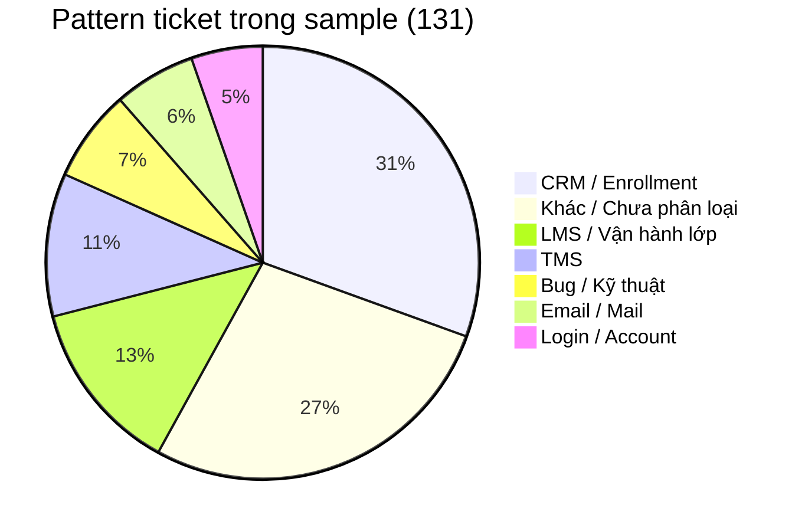

# Báo cáo phân tích ticket sample và lựa chọn automation login

**Nguồn dữ liệu:** `docs/plans/week-5/data/sample.xlsx`  
**Phạm vi bài:** Week 5 - Reporting, Analysis & Automation Implementation

---

## 1. Mục tiêu

Mục tiêu của report không chỉ là thống kê ticket xuất hiện ở đâu, mà là dùng dữ liệu để:

- Nhận diện các pattern ticket lặp lại.
- Ước lượng impact của từng nhóm.
- Chọn một vấn đề phù hợp để tự động hóa theo hướng Operating Engineer.
- Ghi rõ phần nào auto được, phần nào cần support/Dev review.
- Đề xuất action plan để giảm volume ticket trong các vòng tiếp theo.

Theo plan Week 5, vấn đề được chọn để triển khai automation là **Scenario 1 - Login Issue**.

---

## 2. Nguồn dữ liệu

Report dùng file `docs/plans/week-5/data/sample.xlsx` — export ticket từ Odoo Helpdesk. Sau khi gom theo mã ticket và phân loại bằng `Subject + Tags`, dataset có **131 ticket** để phân tích pattern.

---

## 3. Tổng quan pattern ticket

Các ticket trong sample được gom thành 7 nhóm chính:



| Pattern | Số ticket | Tỷ lệ | Nhận xét |
| --- | ---: | ---: | --- |
| CRM / Enrollment | 40 | 30,5% | Nhóm lớn nhất, gồm nhiều case CRM/enroll/lead/payment khác nhau |
| Khác / Chưa phân loại | 36 | 27,5% | Case rời rạc hoặc thiếu tag rõ |
| LMS / Vận hành lớp | 17 | 13,0% | Liên quan lớp, học viên, giáo viên, học phần |
| TMS | 14 | 10,7% | Liên quan chấm công, bảng công, truy cập TMS |
| Bug / Kỹ thuật | 9 | 6,9% | Lỗi kỹ thuật hoặc outage, cần Dev review |
| Email / Mail | 8 | 6,1% | Liên quan mail, email công việc, contact mail |
| Login / Account | 7 | 5,3% | Pattern được chọn để triển khai automation Week 5 |

### Đọc nhanh

CRM / Enrollment là nhóm nhiều ticket nhất, nhưng nhóm này quá rộng và liên quan nhiều nghiệp vụ khác nhau. Không nên lấy toàn bộ nhóm này để auto.

Login / Account chỉ có 7 ticket trong sample, nhưng đây là nhóm có workflow dễ chuẩn hóa hơn: nhận diện login issue, kiểm tra trạng thái user, kiểm tra LMS, rồi quyết định auto xử lý hay chuyển người.

---

## 4. Đánh giá các pattern chính

### 4.1. CRM / Enrollment - 40 ticket

Đây là nhóm có volume cao nhất trong sample. Nội dung có thể bao gồm CRM, lead, enrollment, order, payment hoặc sửa dữ liệu.

**Impact:** volume lớn, thường ảnh hưởng trực tiếp tới vận hành tuyển sinh, chăm sóc khách hàng hoặc dữ liệu học viên.

**Vì sao chưa chọn auto trước:** nhóm này quá đa dạng. Một số case có thể liên quan tiền, trạng thái lead, order hoặc dữ liệu enrollment. Nếu automation sửa sai thì ảnh hưởng trực tiếp tới nghiệp vụ.

**Hướng xử lý phù hợp:** chuẩn hóa form đầu vào, viết SOP theo từng nhánh nhỏ, route đúng owner. Chỉ nên auto sau khi tách được một workflow nhỏ, rõ rule và có cơ chế review.

---

### 4.2. LMS / Vận hành lớp - 17 ticket

Nhóm này gồm các case liên quan lớp, học viên, giáo viên, học phần hoặc thao tác vận hành trên LMS.

**Impact:** ảnh hưởng trực tiếp đến lớp học và trải nghiệm học viên/giáo viên.

**Vì sao chưa chọn auto trước:** nhiều case cần hiểu bối cảnh lớp học. Nếu tự add/sửa nhầm học viên, giáo viên hoặc slot học thì có thể làm sai dữ liệu học tập.

**Hướng xử lý phù hợp:** tạo checklist bắt buộc khi gửi ticket: mã lớp, tên học viên/giáo viên, số điện thoại hoặc mã user, thao tác đã thử, screenshot lỗi.

---

### 4.3. TMS - 14 ticket

TMS liên quan nhiều tới chấm công, bảng công, truy cập hệ thống hoặc thao tác công.

**Impact:** có thể ảnh hưởng tới dữ liệu công/lương hoặc vận hành nhân sự.

**Vì sao chưa chọn auto trước:** dữ liệu công là dữ liệu nhạy cảm. Nếu nhiều ticket cùng thời điểm/cùng triệu chứng, đây có thể là incident hệ thống chứ không phải case riêng lẻ.

**Hướng xử lý phù hợp:** gom ticket cùng pattern, xác định phạm vi ảnh hưởng, cập nhật chung và escalate Dev/ops phụ trách TMS.

---

### 4.4. Bug / Kỹ thuật - 9 ticket

Nhóm này gồm các lỗi kỹ thuật, system error hoặc outage.

**Impact:** ít ticket hơn CRM/LMS/TMS nhưng có thể ảnh hưởng nhiều user trong cùng một thời điểm.

**Vì sao chưa chọn auto trước:** automation support không nên tự sửa lỗi hệ thống khi chưa biết root cause.

**Hướng xử lý phù hợp:** auto có thể hỗ trợ nhận diện keyword như `down`, `lỗi`, `không thao tác được`, sau đó tạo note/escalate. Không auto-resolve.

---

### 4.5. Email / Mail - 8 ticket

Nhóm này liên quan mail contact, email công việc, email TMS hoặc lỗi nhận/gửi mail.

**Impact:** có thể làm gián đoạn trao đổi với khách hàng hoặc vận hành nội bộ.

**Hướng xử lý phù hợp:** viết SOP kiểm tra mail: đúng email chưa, có quyền chưa, mailbox tồn tại chưa, có bị block/spam không.

---

### 4.6. Login / Account - 7 ticket

Nhóm này gồm các ticket như:

- Không đăng nhập được hệ thống.
- Cấp lại mật khẩu LMS.
- Không vào được TMS/CRM/Ecount.
- Tài khoản cần kiểm tra lại trạng thái.

**Impact ước tính theo plan Week 5:** xử lý thủ công khoảng **5-10 phút/ticket** nếu support phải tự đọc ticket, kiểm tra HR, kiểm tra LMS, reactivate/reset và phản hồi user.

**Vì sao chọn làm automation:** đây là pattern nhỏ hơn, dễ giới hạn phạm vi hơn và phù hợp Scenario 1 trong plan Week 5.

---

## 5. Đánh giá ưu tiên automation

Việc chọn automation candidate không nên chỉ dựa trên volume. Một pattern phù hợp để tự động hóa cần có quy trình xử lý lặp lại, điều kiện nhận diện rõ và rủi ro side effect thấp hoặc kiểm soát được.

Trong sample, CRM / Enrollment là nhóm có nhiều ticket nhất. Tuy nhiên nhóm này quá rộng và có thể liên quan đến dữ liệu nghiệp vụ như lead, payment, order hoặc enrollment. Vì vậy report cần so sánh các pattern theo nhiều tiêu chí trước khi chọn automation.

| Tiêu chí | CRM / Enrollment | LMS / Vận hành lớp | TMS / Bug | Login / Account |
| --- | --- | --- | --- | --- |
| Volume | Cao nhất | Trung bình | Trung bình | Thấp hơn |
| Quy trình xử lý | Đa dạng | Cần bối cảnh lớp | Phụ thuộc root cause | Lặp lại hơn |
| Rủi ro nếu auto sai | Cao | Trung bình/cao | Cao | Có thể giới hạn |
| Có thể đặt guardrail | Khó | Trung bình | Khó | Rõ hơn |
| Phù hợp Scenario 1 | Không | Một phần | Không | Có |

Từ góc nhìn Operating Engineer, **Login / Account là nhóm phù hợp nhất để làm automation demo trong Week 5** vì workflow có thể giới hạn, dễ kiểm tra điều kiện và ít side effect hơn so với payment/enroll/TMS.

---

## 6. Phạm vi xử lý Login Issue

Pattern Login / Account trong sample cho thấy nhiều ticket liên quan đến không đăng nhập được, quên mật khẩu hoặc cần kiểm tra trạng thái tài khoản. Với Scenario 1 của Week 5, luồng xử lý tập trung vào trường hợp user vẫn còn hiệu lực trên HR nhưng account LMS đang bị deactivate.

Không phải mọi ticket login đều thuộc nhánh này. Một số case có thể do quên mật khẩu, thiếu account, user inactive hoặc lỗi hệ thống. Vì vậy automation chỉ xử lý khi đủ điều kiện kiểm tra được, còn lại chuyển support review.

---

## 7. Workflow automation đề xuất

Workflow Operating Engineer cho Login Issue:

```text
Odoo ticket mới
  -> kiểm tra ticket có phải login issue không
  -> trích xuất email/định danh user cần xử lý
  -> kiểm tra HR status
  -> kiểm tra LMS account status
  -> quyết định AUTO_RESOLVE / NEED_REVIEW / SKIP
  -> cập nhật Odoo ticket + gửi phản hồi
```

Decision logic:

| Điều kiện | Hành động | Kết quả |
| --- | --- | --- |
| Không phải login issue | Không xử lý | `SKIP` |
| Login issue nhưng thiếu email/định danh của account cần kiểm tra | Không đoán user, yêu cầu bổ sung/chuyển support | `SKIP` hoặc `NEED_REVIEW` |
| HR inactive | Không bật lại LMS | `NEED_REVIEW` |
| HR active + LMS deactivated | Reactivate account, ghi note, phản hồi user | `AUTO_RESOLVE` |
| HR active + LMS active nhưng user vẫn không vào được | Cần kiểm tra password/permission/system | `NEED_REVIEW` |
| Không tìm thấy LMS account | Không tự tạo account mới | `NEED_REVIEW` |
| Nghi lỗi hệ thống | Escalate support/Dev | `NEED_REVIEW` |

Nguyên tắc: **đủ dữ liệu + rule rõ + side effect thấp thì auto; thiếu dữ liệu hoặc rủi ro thì dừng an toàn.**

---

## 8. Automation vs sửa root cause

Nếu nguyên nhân là rule deactivate sau 30 ngày không hoạt động, có hai hướng:

### Sửa root cause

Dev/Product thay đổi rule deactivate, thêm cảnh báo trước khi khóa hoặc làm self-service reset.

Ưu điểm: xử lý tận gốc.  
Nhược điểm: cần thay đổi code/quy trình, test, deploy, mất thời gian.

### Tạo automation theo hướng Operating Engineer

Support/Ops tạo workflow kiểm tra HR + LMS và reactivate khi đủ điều kiện.

Ưu điểm: triển khai nhanh, giảm thao tác lặp, xử lý được phần lớn case đủ điều kiện.  
Nhược điểm: không thay thế hoàn toàn việc sửa rule gốc.

Với Week 5, chọn automation là hợp lý vì mục tiêu bài là Operating Engineer: **giải quyết việc lặp lại bằng workflow an toàn, không chờ sửa code trước**.

---

## 9. Action plan giảm volume ticket

### Login / Account

- Viết SOP login issue: cần email đăng nhập, hệ thống gặp lỗi, screenshot nếu có.
- Thêm template phản hồi reset password.
- Chạy automation cho LMS login khi đủ điều kiện.
- Theo dõi các case `NEED_REVIEW` để cải thiện rule.

### CRM / Enrollment

- Tách nhỏ nhóm CRM thành payment, lead, enroll, order.
- Chuẩn hóa form ticket: mã lead/order, mã lớp, học viên, số điện thoại.
- Route payment/order tới người có quyền.
- Không auto sửa dữ liệu tài chính.

### LMS / Vận hành lớp

- Bắt buộc mã lớp, tên học viên/giáo viên, mã user.
- Viết SOP cho lỗi enroll/lớp/học phần thường gặp.
- Chỉ cân nhắc automation cho case đọc/kiểm tra, chưa tự sửa dữ liệu lớp.

### TMS / Bug kỹ thuật

- Gom ticket cùng thời điểm/cùng triệu chứng thành incident.
- Escalate Dev/ops owner.
- Cập nhật chung cho các ticket liên quan để tránh xử lý lặp.

---

## 10. Metrics cần đo sau automation

Để chứng minh automation hiệu quả, cần đo:

- Số ticket login tool nhận diện được.
- Tỷ lệ `AUTO_RESOLVE`.
- Tỷ lệ `NEED_REVIEW`.
- Tỷ lệ `SKIP` vì thiếu thông tin.
- Thời gian xử lý trung bình trước/sau automation.
- Số lần support phải can thiệp thủ công.
- Số false action hoặc lỗi xử lý sai account.

Chỉ nên kết luận tiết kiệm thời gian sau khi có số liệu thực tế trước và sau khi chạy workflow.

---

## 11. Kết luận

Phân tích sample ticket cho thấy workload support tập trung nhiều ở CRM / Enrollment, LMS / Vận hành lớp và TMS. Tuy nhiên các nhóm nhiều ticket nhất thường liên quan dữ liệu nghiệp vụ, tiền, lớp học hoặc hệ thống nên không phù hợp để auto-resolve ngay.

Login / Account có ít ticket hơn nhưng là pattern phù hợp với mục tiêu Week 5: quy trình xử lý lặp, có thể kiểm tra bằng HR/LMS, đặt được guardrail và tích hợp được với Odoo webhook/API.

Vì vậy lựa chọn hợp lý cho bài là: **dùng data để chứng minh có pattern lặp, chọn Login Issue làm automation candidate theo Scenario 1, triển khai workflow có điều kiện, và đo hiệu quả sau khi chạy.**
